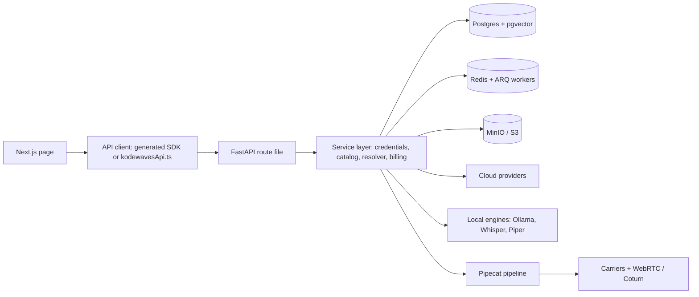
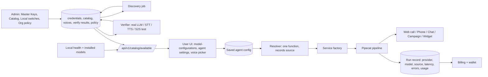
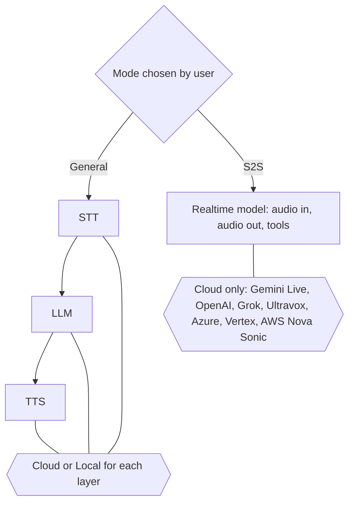

# KODEWAVES - COMPLETE PLATFORM PLAN AND ANTIGRAVITY PROMPT (VERSION 2, ONE FILE)


Date: 5 Oct 2026. This file replaces every earlier plan file.

Built from: your zip `newai.zip` (scanned file by file), your Antigravity chat, the admin page you pasted, Piper's source code, and live provider documentation.


## 0. READ THIS FIRST (simple steps)


1. Save this file as `KODEWAVES_COMPLETE_PLAN_AND_PROMPT.md` in the repo root (next to `deploy.sh`).

2. Delete the Gemini key that ends in `FVoQ` in Google AI Studio and make a new one. It was leaked in a chat.

3. Open Antigravity in Planning mode. Paste **only the text inside the code block of Part 15** (from `ROLE` to the last line).

4. Antigravity will ask five questions once (Part 14). Answer them in one message.

5. It then works alone on a branch called `stabilize` and stops before touching your live server. You deploy yourself.


**What this file is:** the specification. Parts 1-14 are what Antigravity reads. Part 15 is the prompt you paste.

**What is new in version 2:** every number re-checked in your zip; a "Connections" part (Part 3) showing how every layer links; every one of the 46 pages described with its real API calls, logic, features, functions, fixes and pass test (Part 10); an admin-to-user matrix (Part 11); a full backend route index (Appendix A).

**Honest limits:** nothing was run on your server. The zip may be older than your GitHub `main`. Items marked **VERIFY** need one command or one real test.


## Contents


1. Where the platform is now (verified facts)

2. The core logic: key in Admin -> models in User panel

3. Connections: how every layer links (maps and 9 data flows)

4. Provider and model matrix, every provider, embeddings, modes

5. Admin data contract and Verify tests

6. Local self-hosted stack and server resources

7. S2S (Speech to Speech)

8. Calls, telephony, quota, billing

9. Backend, database, Docker, env vars, carriers, workers, frontend

10. Page-by-page specification (all 46 pages)

11. Admin action -> user panel effect matrix

12. Security and hygiene

13. Phases, test harness, acceptance table

14. What I need from you

15. THE PROMPT for Antigravity

- Appendix A: backend route index (generated from the zip)

- Appendix B: environment variables read by code but not documented

- Appendix C: hardcoded model and voice names found in the UI


---


# 1. Where the platform is now (verified facts)


## 1.1 Numbers re-checked in the zip (5 Oct 2026)


| Item | Real value in your zip |

|---|---|

| UI pages (`page.tsx`) | **46** |

| Backend route files | **52** (about **268** route decorators in 45 of them, plus websocket and app-level routes; exact count must come from the OpenAPI snapshot in WP0) |

| Alembic migrations | **102 revisions, exactly one head** (`f4b18c7d9a01`). Healthy graph. |

| Existing tests | **260 backend test files, 36 UI test files**. Never used as a gate. |

| Env vars read by code but not in `.env.example` or compose | **53** (list in Appendix B) |

| Docker | 3 compose files that drifted apart. aaPanel compose: no healthchecks on api, ui, ollama, piper, whisper; Piper 384 MB, Whisper 384 MB, Ollama 1024 MB; `:latest` tags. Root compose: Redis `6379` and UI `3010` published on all interfaces. |

| `agent_auth` crash | The text `agent_auth` no longer appears anywhere in the API code. That crash looks fixed. Keep the import smoke test so it cannot return. |

| `WHISPER_MODEL` in aaPanel compose | Set to `Systran/faster-whisper-tiny`; Speaches ignores it. |


## 1.2 Why "nothing works" (root causes, with evidence)


| Cause | Evidence in the zip |

|---|---|

| **The "dynamic catalog" is a hand-typed list.** `api/routes/catalog.py` holds fixed Python lists (`DEFAULT_CLOUD_LLM_MODELS`, `..._STT_...`, `..._TTS_...`, `..._S2S_...`). They contain retired or wrong models: `gemini-2.5-flash`, `gemini-2.0-flash`, `claude-3-5-sonnet-20241022`, `claude-3-5-haiku-20241022`, `sarvam-2b`, `saaras:v2`, `bulbul:v1`, `gemini-2.5-flash-preview-tts`. | `api/routes/catalog.py` lines 17-60. |

| **The database catalog is never used.** `list_active_models()` has **zero callers**. | grep over `api/`. |

| **The key "Test" button only checks connectivity.** `test_connection` calls the provider's `/models` URL and returns OK on HTTP 200. It never runs an LLM, STT, TTS or S2S request. Navana's test posts with no audio. | `api/services/credentials/master_credential_service.py` line 137 onward. |

| **The UI has hard-coded voice names.** `/model-configurations` and `/workflow/[id]/settings` contain fixed preview URLs for OpenAI (alloy, echo, fable, nova, onyx, shimmer), Deepgram (aura-asteria-en, aura-orion-en), ElevenLabs (two voice ids), Google (Puck, Charon, Kore, Fenrir, Zephyr), Cartesia, Piper (five voices) and Sarvam (amrita, arvind). | Appendix C. |

| **Retired Gemini models used everywhere.** `gemini-2.0-flash` shut down 1 Jun 2026. `gemini-2.5-flash` shuts down 16 Oct 2026 and returns 404 for many keys. The repo still uses `gemini-2.5-flash` 13 times and `gemini-2.0-flash` 3 times. | grep over `api/services/configuration` and `api/constants.py`. |

| **Old Sarvam names still in repo options.** `sarvam-2b`, `sarvam-30b`, `bulbul:v1`, `saarika:v1` remain next to the current `sarvam-105b`, `bulbul:v2/v3`, `saarika:v2.5`, `saaras:v3`. | `options/sarvam.py`. |

| **Retired Claude names.** `claude-3-5-*`, `claude-3-opus` appear in config. Current: `claude-haiku-4-5-20251001`, `claude-sonnet-5-5`. | grep. |

| **No real testing.** Only `py_compile` and bracket counts were used. The server build failed on 3 Oct from two duplicate lines. | Chat log. |

| **Local engines mis-sized.** Piper used 569 MB but is capped at 384 MB. Whisper needs models downloaded first. Ollama 0.5B/1.5B cannot run tool flows. | docker stats; compose lines. |

| **Silent fallbacks and sentinel keys** hide real errors. | `kodewaves_resolver.py`, `service_factory.py`. |

| **Everything pushed to `main` and deployed live.** | Chat log. |


## 1.3 Page-level findings from the scan


| Finding | Where |

|---|---|

| `/overview` has **no API calls**: it is a fixed set of link tiles (275 lines). The plan requires real aggregates. | `ui/src/app/overview/page.tsx` |

| `/automation` is a **39-line page with no API calls**: a placeholder. The Part 10 spec defines what it must do, or it must be hidden. | `ui/src/app/automation/page.tsx` |

| `/superadmin` has no direct API calls (links only); `/superadmin/runs` has one real call. | `ui/src/app/superadmin` |

| `/billing` still calls **managed-service leftovers**: `/organizations/billing/credits` and `/organizations/usage/mps-credits/purchase-url`. The real wallet is `/billing-sovereign`. Two billing pages exist; they must be merged or one must redirect. | `ui/src/app/billing` |

| `adminApi` in `kodewavesApi.ts` has **no verify, discover, whisper-manager or catalog-visibility functions**. `/admin/settings` has managers for Ollama and Piper only. | `ui/src/lib/kodewavesApi.ts` |

| Admin master-key test route exists twice (`POST /admin/master-keys/test` and `POST /admin/master-keys/{provider}/test`). Keep one. | `api/routes/admin/master_keys.py` |

| `/model-configurations` and `/workflow/[id]/settings` already read `/catalog/available`. The wiring exists; the data behind it is the static list. | UI + `catalog.py` |


## 1.4 The admin page you pasted


1. The Gemini key shown ends in `FVoQ` (same ending as the leaked key). **Rotate it.**

2. **Krutrim has a card but no backend code** (only two UI files mention it). Remove the card or mark "Not supported".

3. Card descriptions are typed marketing text and are stale ("2.5 Flash", "Puck, Journey", "Sarvam 2B", "Claude 3.5", "Nova-2"). "Journey" is not a Gemini voice.

4. The Piper card says "21+ verified voices" as typed text. It must show the real installed count from the Piper server.

5. Cards for Smallest, LMNT, Rime, Navana, Exotel, Plivo, Twilio have backend support. Keep them with the same verify rules.


## 1.5 What Antigravity did that is worth keeping (still must be tested live)


Master-key database lookup fix; "disabled key never falls back to env"; missing imports that crashed calls; `FORWARDED_ALLOW_IPS` and Twilio signature URL candidates (real cause of "application error" on phone calls); S2S filter fix; Cloud/Local per layer; General vs S2S dual mode; admin Ollama and Piper managers; Piper host port moved off 5000; Docker cache prune script.


## 1.6 Correction on Piper


Piper 1.8.0 serves synthesis on `POST /synthesize`. Keep `/synthesize` in the Piper URL. (An earlier note saying otherwise was wrong.)


---


# 2. THE CORE LOGIC: key in Admin -> models in User panel


Every page depends on this. Follow it exactly.


> **When the admin saves a working key for a provider, every model and voice that key can really use appears in the user panel, in the right place (LLM, STT, TTS, embeddings or S2S). When the key is removed, disabled, or stops working, those models disappear. Nothing appears that has not passed a real test.**


## 2.1 Lifecycle


| Step | What happens | Where it shows |

|---|---|---|

| 1. Save key | Admin opens `/admin/models`, clicks a provider card, enters key (plus region / deployment names / account id when needed), Save. Encrypted (Fernet). Audit log written. Status UNTESTED. | Card: "Saved, testing..." |

| 2. Discover | Backend calls the provider's own list APIs with that key (Gemini `ListModels`, OpenAI/Groq/Anthropic `/models`, ElevenLabs models + voices, Cartesia voices, Deepgram models, Azure voices by region, Sarvam from repo options). Results are classified by layer and written to the catalog and voice tables. | Admin "Model Catalog" tab fills. |

| 3. Verify | Real test per layer for the provider's default model: LLM (short chat, plus one tool call if tool-capable), STT (bundled Hindi and English clips, expected words), TTS (Hindi and English phrase, length and sample rate), S2S (open realtime socket, send audio, receive audio), embeddings (one sentence, vector length). | Per-layer badges with the real error text. |

| 4. Auto-enable | Recommended models that **passed** switch ON. Extra discovered models are added OFF. | Admin catalog ON/OFF. |

| 5. Catalog endpoint | `/api/v1/catalog/available` builds the list for the current organization with the visibility formula. 60 s cache, cleared on any admin change. | Every user page. |

| 6. User picks | `/model-configurations` and `/workflow/[id]/settings` render dropdowns **only** from that endpoint: Mode -> per-layer Cloud/Local -> provider -> model -> voice. | User panel. |

| 7. Save config | Backend re-validates provider, model and voice against the catalog; rejects anything not visible to that organization. | Saved agent config. |

| 8. Call time | Resolver re-checks key active, model enabled, voice exists; picks credentials in policy order (default: organization's own key, else platform key). Neither = clear failure. **No silent fallback.** | Run page: provider, model, source, latency per stage. |

| 9. Key removed/disabled | Models vanish within about 60 s. Agents using them show a red "This model is no longer available, choose another". Calls fail clearly. | Everywhere. |

| 10. Provider retires a model | Daily discovery plus any Verify failure mark it UNAVAILABLE, hide it, and alert the admin dashboard. | Admin dashboard + catalog. |


## 2.2 Visibility formula


- **Cloud model visible** = provider key active AND model enabled AND last verify PASS (or admin force-enabled with a warning) AND organization allowed that provider.

- **BYOK** = same, using the organization's own key, shown with a "Your key" badge.

- **Local visible** = Local AI switch ON AND engine healthy AND model/voice installed AND organization has local access.

- **S2S visible** = realtime provider key active AND S2S enabled for that provider AND verify PASS AND org allowed.

- **Voices visible** = voices of the **selected** TTS provider and model only, filtered by language, with a working preview. Never mix providers.


## 2.3 Worked examples (use as tests)


| Example | Expected result |

|---|---|

| Admin saves a valid Gemini key | LLM shows Gemini 3.5 models; STT only if its test passes; TTS shows `gemini-3.1-flash-tts-preview` with its voices (from docs/discovery, not typed); S2S shows Gemini Live. Nothing from other providers. |

| Admin saves an Anthropic key | Only the LLM list gains Claude models (current ones). |

| Admin saves a Deepgram key | STT gains Deepgram; TTS gains Aura voices. LLM unchanged. |

| Admin saves a Sarvam key | LLM `sarvam-105b`; STT `saarika`/`saaras`; TTS `bulbul` with its own voices; Indian languages. |

| Wrong key | Card says Failed with the provider's error. Nothing appears for users. |

| Valid key, no TTS access | LLM Verified, TTS Failed. Only LLM models appear. |

| Admin disables a key | Models vanish in under 1 minute; agents show the red notice. |

| No cloud key and Local OFF | Empty lists with "No models are enabled. Ask your admin" and (if allowed) an "Add your own key" field. |

| Local ON, Ollama has 2 models, Piper has 3 voices | Local pills show exactly 2 LLM models and 3 voices. |


## 2.4 Admin controls that shape the user panel


Provider on/off; model on/off; default model per layer; voice on/off; "recommended" star; per-organization overrides (allowed providers, Local allowed, BYOK allowed, S2S allowed); price rates and margins per mode; optional fallback chain (off by default); concurrency caps.


---


# 3. Connections: how every layer links


## 3.1 The layers (left to right)





## 3.2 Admin to user (the heart)





## 3.3 General vs S2S





## 3.4 Nine data flows (each must work end to end)


**Flow A. Save a key (admin).** `/admin/models` -> `POST /admin/master-keys` (encrypts, writes `platform_master_credentials`, audit log) -> new `POST /admin/master-keys/{provider}/discover` -> writes `ai_model_catalog` and `voice_catalog` -> new `POST .../verify` -> writes `catalog_verify_runs`, status and latency -> cache cleared -> `/catalog/available` now includes the models. *Break test:* wrong key shows FAIL and nothing appears for users.


**Flow B. User chooses models.** `/model-configurations` -> `GET /catalog/available` + `GET /user/configurations/voices/{provider}` -> user picks -> `PUT /organizations/model-configurations/v2` (server re-validates against catalog) -> row in `organization_configurations`. `/workflow/[id]/settings` does the same per agent and stores into the workflow definition. *Break test:* posting a model not in the catalog returns a clear 4xx.


**Flow C. Web call (Test Audio).** `/workflow/[id]` button -> `POST /workflow/{id}/runs` creates `workflow_runs` row -> browser opens WebRTC via `webrtc_signaling` using Coturn from `GET /turn-credentials` -> pipeline starts: resolver reads config -> factory builds STT/LLM/TTS or S2S -> audio flows -> transcript, recording (MinIO), usage -> `/workflow/[id]/run/[runId]` shows provider/model/source/latency per stage -> wallet deduction. *Break test:* bad key gives a visible error on the run page, not silence.


**Flow D. Phone call (inbound and outbound).** Carrier config saved on `/telephony-configurations` (`organization telephony-configs`, phone numbers, trunks) -> inbound: carrier calls `/api/v1/telephony/inbound/run` -> signature check using the public https URL -> run created -> media stream websocket -> same pipeline at 8 kHz -> status callbacks, recording, usage. Outbound: `POST /telephony/initiate-call`. *Break test:* `scripts/e2e/twilio_signature.py` through Nginx returns 200.


**Flow E. Campaign.** `/campaigns/new` -> `POST /s3/presigned-upload-url` (CSV to MinIO) -> `POST /campaign/create` -> pre-flight (keys verified, voice exists, wallet) -> `POST /campaign/{id}/start` -> ARQ `campaign_tasks` and orchestrator dial in batches within concurrency caps -> each call is Flow D outbound -> `/campaigns/[id]` reads `runs`, `traffic-stats`, `report`; pause/resume/redial.


**Flow F. Knowledge base.** `/files` -> `POST /knowledge-base/upload-url` -> upload to MinIO -> `POST /knowledge-base/process-document` -> ARQ `knowledge_base_processing` chunks and embeds with the organization's embeddings model -> `knowledge_base_chunks` (pgvector) -> agent KB node queries it during a call. Changing the embeddings model requires re-embed.


**Flow G. Billing.** `/pricing` and `/billing-sovereign` -> `GET /billing-sovereign/plans`, `/wallet`, `/ledger` -> `POST /billing-sovereign/subscribe` / payments -> Razorpay/Stripe checkout -> **verified** webhook/HMAC -> `organization_wallets` + `wallet_ledger` credit. Every call deducts via the same ledger. No free-minutes endpoint.


**Flow H. Widget / embed.** `/widgets` and `/workflow/[id]/settings` -> embed token (`POST /workflow/{id}/embed-token`) -> script on outside site -> `public_embed` / `public_embed_chat` routes (no login) -> same pipeline with domain allow-list and rate limit.


**Flow I. Auth and roles.** `/auth/login|signup` -> `POST /api/v1/auth/login|signup` -> token in cookie and localStorage -> layout calls `GET /user/auth/user` -> role guard for `/admin` and `/superadmin` in UI **and** `get_superuser` dependency in every admin route. `is_active=false` blocks every auth path including API keys. Impersonation (`POST /superuser/impersonate`, `/admin/users/{id}/impersonate`) is logged in the audit table.


## 3.5 Connection checklist (must be true, test each)


| Link | Test |

|---|---|

| UI function -> backend route exists | Script compares `kodewavesApi.ts` and SDK URLs with the OpenAPI list (CI). |

| Backend route -> role check | Auth matrix test: admin routes 403 for normal user, 401 anonymous. |

| Route -> tenant scope | Two test organizations never see each other's rows. |

| Catalog -> UI | Dropdown contents equal `/catalog/available` output (Playwright). |

| Resolver -> factory -> provider | Unit test per provider branch; bad key = error text. |

| Pipeline -> run record | Every call writes provider/model/source/latency/error. |

| Run -> wallet | Ledger rows equal run minutes at the stored rate; local = 0. |

| Worker -> database | Each ARQ job type has a real staging test. |

| Webhook -> carrier signature | Signed request test through Nginx. |


---


# 4. Provider and model matrix


**Where IDs come from, in this order:** (1) repo files `api/services/configuration/registry.py` and `options/*.py`; (2) the provider's live list API with the admin's key; (3) official docs with a link in a code comment. Never from memory. Mark each as (repo), (docs 5 Oct 2026) or (discover).


## 4.1 Models and traps per provider


| Provider | LLM | STT | TTS | S2S | Traps |

|---|---|---|---|---|---|

| **Google Gemini** | `gemini-3.5-flash`, `gemini-3.5-flash-lite`, `gemini-3.1-flash-lite` (repo, docs). Avoid 2.0 (dead) and 2.5-flash (404, shuts 16 Oct). | Gemini Live transcribe in vendored Pipecat (`gemini-3.5-transcribe-live`). **VERIFY** before showing. | `gemini-3.1-flash-tts-preview` (docs, repo default): about 30 voices, Hindi, streaming. Hide 2.5 TTS. Fetch voice names from docs. | `gemini-3.1-flash-live-preview` (repo, docs). Repo voices: Puck, Charon, Kore, Fenrir, Aoede. | "Journey" is not a Gemini voice. Preview audio is raw 24 kHz PCM: add a WAV header. Use the API key, not a Google Cloud JSON file. |

| **OpenAI** | (discover) | (discover, `whisper-1` family) | (discover) `tts-1`, `tts-1-hd`, newer | `gpt-live-1`, `gpt-realtime-2.1`, `gpt-realtime-2.1-mini`, `gpt-realtime-2` (repo). Voices marin, cedar (repo). | Realtime is a different protocol from chat. |

| **Anthropic** | `claude-haiku-4-5-20251001` (fast, best for voice), `claude-sonnet-5-5`. `claude-3-5-*` retired. | none | none | none | LLM only. |

| **Groq** | (discover `/openai/v1/models`) | (discover) | none | none | Do not hardcode Llama names. |

| **Deepgram** | none | `nova-3`, `nova-2`; Flux `flux-general-en`, `flux-general-multi` (repo). Always set language explicitly. | Aura voices (discover) | none | Past crash: unset `language`. Keep a test. |

| **Cartesia** | none | `ink-2`, `ink-whisper` (repo) | Sonic models (repo `options/cartesia.py`); voices (discover) | none | |

| **ElevenLabs** | none | `scribe_v2_realtime` (repo) | models and voices (discover) | none | No hardcoded voice ids. |

| **Sarvam** | `sarvam-105b` (repo) | `saarika:v2.5`, `saaras:v3` (repo) | `bulbul:v2`, `bulbul:v3` + voices in `options/sarvam.py` (repo) | none | Remove `sarvam-2b`, `sarvam-30b`, `bulbul:v1`, `saarika:v1`. Codes like `hi-IN`. |

| **Azure** (Speech, OpenAI, Realtime) | Azure OpenAI deployment names from admin | Azure Speech (region) | Azure Neural voices by region, e.g. `hi-IN-SwaraNeural` | Azure Realtime GA `v1` (repo) | Needs key + region (+ deployments). |

| **Navana / Bodhi** | none | Indic STT | Indic TTS | none | Test posts need real audio. |

| **Smallest, LMNT, Rime** | none | Smallest STT | TTS (discover) | none | Supported in code. |

| **xAI Grok** | (discover) | none | (discover) | `grok_realtime`: Ara, Rex, Sal, Eve, Leo (repo) | Aliases `grok`, `xai`. |

| **Ultravox** | none | none | none | `ultravox_realtime` (repo) | Check Hindi output. |

| **AWS Bedrock** | Claude on Bedrock | none | Polly | Nova Sonic (repo) | IAM keys + region. |

| **Google Vertex** | Vertex Gemini (repo) | `chirp_3` (repo) | Chirp 3 HD (repo) | `google/gemini-live-2.5-flash-native-audio` (repo) | Service-account JSON. |

| **Krutrim** | **No backend code.** | | | | Remove the card. |

| **Local Ollama / Whisper / Piper** | installed only | downloaded only | installed voices only | none | Part 6. |


**Alias rule (one shared function):** `openai_realtime`->`openai`; `google_realtime`->`gemini`/`google`; `azure_realtime`->`azure`; `grok_realtime`->`grok`/`xai`; `ultravox_realtime`->`ultravox`; `azure_speech`<->`azure`; `bodhi`<->`navana`.


## 4.2 Every provider and every layer in this repo


Source: `ServiceProviders` and the configuration classes in `registry.py`. **Every provider with working code gets an admin card generated from the registry. A provider without code (Krutrim) gets none.**


| Provider | LLM | STT | TTS | Embeddings | S2S | Note |

|---|---|---|---|---|---|---|

| OpenAI | yes | yes | yes | yes | yes | |

| Azure OpenAI | yes | | | yes | yes | deployment names |

| Azure Speech | | yes | yes | | | region |

| Google Gemini (AI Studio) | yes | yes | yes | yes | yes | |

| Google Cloud / Vertex | yes | yes | yes | | yes | service-account JSON |

| Anthropic | yes | | | | | |

| Groq | yes | | | | | |

| OpenRouter | yes | | | yes | | |

| AtlasCloud | yes | | | | | no admin card yet |

| AWS Bedrock | yes | | | | yes | IAM + region |

| HuggingFace | yes | yes | | | | no admin card yet |

| MiniMax | yes | | yes | | | no admin card yet |

| Sarvam | yes | yes | yes | | | Indian languages |

| Deepgram | | yes | yes | | | |

| Cartesia | | yes | yes | | | |

| ElevenLabs | | yes | yes | | | |

| Smallest AI | | yes | yes | | | |

| Navana / Bodhi | | yes | yes | | | |

| Speechmatics, AssemblyAI, Gladia | | yes | | | | no admin card yet |

| Inworld, Camb, Speechify | | | yes | | | no admin card yet |

| Rime, LMNT | | | yes | | | |

| xAI / Grok | | | yes | | yes | |

| Ultravox | | | | | yes | |

| Local: Ollama / Whisper / Piper | yes / | / yes / | / / yes | | | installed only |

| Krutrim | | | | | | **remove card** |

| `kodewaves`, `dograh` managed services, Speaches LLM/TTS classes | | | | | | **legacy: remove or hide** |


## 4.3 Embeddings layer


Powers the knowledge base (`/files`, tables `knowledge_base_documents`, `knowledge_base_chunks` with pgvector). Providers: OpenAI, OpenRouter, Azure OpenAI, Google Gemini. Admin catalog has an **Embeddings** tab. Verify: embed one sentence; vector length must equal the stored dimension. **Rule:** changing the embeddings model or dimension invalidates old chunks, so the UI warns, offers "re-embed all files", and blocks the change during a re-index.


## 4.4 Modes


| Mode | Who supplies the key | Applies to |

|---|---|---|

| Platform (master) key | Admin | All cloud providers |

| BYOK | The organization, only if the admin allows | All cloud providers |

| Local | No key; engine on your server | Ollama, Whisper, Piper |

| General pipeline | | Any mix of the above per layer |

| S2S realtime | Admin or BYOK | Gemini Live, OpenAI, Grok, Ultravox, Azure, Vertex, Nova Sonic |

| Telephony | Platform carrier account or the organization's own | Part 9.5 |


---


# 5. Admin data contract and Verify tests


| Store | Holds | Written by |

|---|---|---|

| Master credentials | Encrypted key (+ region, deployments, account id), enabled flag, last test time and result | Admin |

| Model catalog | provider, layer (llm / stt / tts / embeddings / s2s), model_id, label, source (built-in / discovered / custom), **enabled**, default-for-layer, recommended, languages, supports_tools, supports_streaming, status (PASS / FAIL / UNTESTED / UNAVAILABLE), latency_ms, last_verified_at, last_error, wholesale cost, markup | Seeder, discovery, admin |

| Voice catalog | provider, tts model, voice_id, name, languages, gender, preview_ok, enabled | Discovery, admin |

| Local engines | endpoints, enabled, installed models and voices, health, concurrency cap | Admin + health job |

| Org policy | allowed providers, Local allowed, BYOK allowed, S2S allowed, fallback chain, caps | Admin |

| Audit log | every change above | Automatic |


| Layer | Verify test (real request) |

|---|---|

| LLM | One short chat returns text; if tool-capable, one tool call succeeds. |

| STT | Bundled clips `tests/fixtures/audio/hi_*.wav`, `en_*.wav`; transcript contains the expected words. |

| TTS | Hindi and English phrase returns audio longer than 0.5 s at the expected sample rate. |

| S2S | Open the realtime socket, send a clip, receive audio. |

| Embeddings | Embed one sentence; vector length equals stored dimension. |

| Local | Ollama one chat; Whisper one transcription; Piper one synthesis per installed voice. |


Buttons: **Verify** (per provider and layer), **Verify all**, **Re-discover**; each shows PASS/FAIL, milliseconds and the real error. Card descriptions are generated from the catalog, never typed.


---


# 6. Local self-hosted stack and server resources


**Principle:** Local is a real option, honestly sized. Each container has a **floor** (enforced at install) and a **default limit** the admin may raise in `.env`. The server (Hostinger KVM 4, assumed 4 vCPU / 16 GB, **VERIFY with `free -h`**) also hosts other sites, so Kodewaves must not starve them.


| Service | Floor RAM | Default limit | Facts |

|---|---|---|---|

| postgres | 512 MB | 1 GB | pgvector |

| redis | 128 MB | 256 MB | set maxmemory |

| minio | 256 MB | 512 MB | recordings and files |

| api (+workers) | 1 GB | 2 GB | `FASTAPI_WORKERS`, `ARQ_WORKERS` from CPU count (start 2 each) |

| ui | 384 MB | 512 MB | |

| coturn | 128 MB | 256 MB | UDP 3478, 5349, 49152-49350 open |

| **Piper** TTS | 512 MB | 768 MB | Observed 569 MB. `POST /synthesize`, `GET /voices`, `GET /all-voices`, `POST /download`. **A missing voice silently uses the default voice**: check `/voices` first. Output 22.05 kHz; resample to 8k/16k/24k. |

| **Whisper** (Speaches, STT only) | 768 MB `base`, 1 GB `small` | 1.5 GB | Models must be **downloaded first** (`PRELOAD_MODELS` or `POST /v1/models/<id>`). Remove `WHISPER_MODEL`. int8. `tiny` demo only. About 1-3 s per utterance on shared CPU. |

| **Ollama** LLM | OFF by default | 4-5 GB when ON | `qwen2.5:0.5b/1.5b` demo only (no reliable tool calls). Offer 3B+ only after a tool-call test passes. `KEEP_ALIVE=5m`. |


Core stack without Ollama is about 3.5-4.5 GB; with a 3B Ollama about 8-9 GB.


**Local switch:** the UI switch hides local options and blocks local calls but cannot stop containers. Ollama, Whisper, Piper live in Compose **profile `local`**, started by `deploy.sh` only when `ENABLE_LOCAL_AI_ENGINE=true`. The admin page tells the admin to run `deploy.sh` to free RAM.


**Admin local managers:** *Ollama:* list, pull, delete, tool-call test, RAM. *Whisper:* list, download (`base`, `small`), delete, Hindi transcription test. *Piper:* read `/all-voices`, language filter (Hindi, Telugu, Malayalam, Marathi, Bengali, Nepali, English...), install `/download`, delete, play test, real installed count. **No invented voice names.**


**Installer preflight (`install.sh`):** print host RAM/CPU/disk and what is free; find free ports; compare limits with floors (refuse below, warn above free); Lite or Standard tier; create 2-4 GB swap if none; own compose project and network; never touch other sites except printing one Nginx snippet; never `down -v` without a typed confirmation; `pg_dump` before migrations.


| Setup | Turn delay (target, replace with measured) | Concurrent calls (4 vCPU shared) |

|---|---|---|

| Cloud STT + LLM + TTS | 0.5-0.9 s | limited by API container; measure |

| Cloud STT + LLM + Piper | 0.7-1.2 s | good |

| All local | 2-5 s | 1-2 |

| S2S | 0.3-0.6 s | API container and provider quota |


---


# 7. S2S (Speech to Speech)


- Cloud only: Gemini Live, OpenAI (`gpt-live-1` and realtime family), Grok, Ultravox, Azure Realtime, Google Vertex, AWS Nova Sonic. Use repo option lists. Show only providers with an active, verified key.

- **No open-source S2S** supports Indian languages without a GPU. UI says: "Local S2S is not available. Use the local cascade."

- Per provider the editor shows its own model, voices, languages, required fields, a link to the admin key if missing, and a BYOK field when allowed.

- Must support tool calls, interruption, hang-up, transcript, recording, usage metering. S2S billing rate is an **admin setting**.


---


# 8. Calls, telephony, quota, billing


| Path | Must work | Known causes already found |

|---|---|---|

| Web call (Test Audio) | Connect, greeting, speech recognized, reply spoken, transcript, recording | Pipeline crash from missing imports; keys not loaded; Coturn ports closed. |

| Phone (Twilio, Exotel, Plivo, Telnyx, Vonage, Cloudonix, Vobiz, ARI) | Inbound and outbound, two-way talk, hang-up, recording, usage | "Application error" = webhook signature fails because Nginx hides https; need `FORWARDED_ALLOW_IPS`, public URL, signature candidate URLs; phone audio 8 kHz mu-law. |

| Chat test | Text reply and tools | "Missing correlation id" (managed-service leftover). |

| Campaign | Pre-flight (keys, voice, wallet), batch dial, live status | Silent drops when a voice or key is missing. |

| Widget | WebRTC voice or chat on an outside site | Public embed route must work without login. |


**Per-call record:** provider and model per layer, source (user key / master key / local), voice, language, first-audio latency per stage, any error or fallback, duration, minutes charged, recording, transcript. Shown on the run page and admin live monitor.


**Quota and billing rules:** cloud cascade deducts at the cascade rate; S2S at the S2S rate; **local calls free**; admin test calls free. Zero balance on a cloud call gives a clear "Wallet is empty, top up". Paid plans and top-ups only with **verified payment** (HMAC for Razorpay, webhook for Stripe). No free-minutes endpoint. Trial once per organization. A wallet ledger row for every charge and credit. Rates and margins editable by admin.


---


# 9. Backend, database, Docker, env vars, carriers, workers, frontend


## 9.1 Backend modules


| Module | Responsibility |

|---|---|

| credential service | Encrypt/decrypt keys, alias map, enabled flag, **no env fallback when a key is disabled**. |

| catalog service | Tables in Part 5, visibility formula, per-org view, cache with invalidation. Replaces the static lists in `api/routes/catalog.py`. |

| discovery service | Provider list APIs, classification, upsert, daily schedule. |

| verifier | Real tests per layer; stores PASS/FAIL, latency, error. |

| local engine manager | Health, installed models and voices, install/delete, floors. |

| resolver (one function) | Config -> typed result with `source` and per-layer provider/model/voice/language. |

| language normalizer | One map for STT, TTS and Piper voice choice. |

| service factory | Builds Pipecat services; resampling; no dead Dograh/Speaches/Kokoro paths. |

| quota + billing | Part 8. |

| call logger | Per-call record. |

| audit | Every admin change. |


| New or changed API | Purpose | Auth |

|---|---|---|

| `GET /api/v1/catalog/available` | The only source for user dropdowns (rewrite from DB) | user |

| `GET /api/v1/user/configurations/voices/{provider}` | Voices for the selected provider and model | user |

| `GET .../voices/{provider}/{voice}/preview` | Authenticated audio preview | user |

| `POST /api/v1/admin/master-keys/{provider}/verify` (new) | Verify per layer (keep one test route only) | superadmin |

| `POST /api/v1/admin/master-keys/{provider}/discover` (new) | Re-discover | superadmin |

| `POST /api/v1/admin/master-keys/verify-all` (new) | One report | superadmin |

| `GET/PATCH /api/v1/admin/models` (existing, extend) | Enable/disable, defaults, margins | superadmin |

| `GET/POST/DELETE /api/v1/admin/settings/ollama/*` | Ollama manager (exists) | superadmin |

| `GET/POST/DELETE /api/v1/admin/settings/whisper/*` (new) | Whisper models | superadmin |

| `GET/POST/DELETE /api/v1/admin/settings/piper/*` | Piper voices via `/all-voices`, `/download` (extend) | superadmin |

| `GET /api/v1/admin/system-test` (new) | Health of every container and provider | superadmin |

| `GET /api/v1/health` | Public health | none |


## 9.2 Database (Postgres 17 + pgvector, about 45 tables, 102 migrations, one head)


| Group | Tables |

|---|---|

| Identity and tenancy | `users`, `organizations`, `organization_configurations`, `user_configurations`, `api_keys`, `organization_usage_cycles`, `external_credentials` |

| Agents | `workflows`, `workflow_definitions`, `workflow_templates`, `workflow_runs`, `workflow_run_text_sessions`, `workflow_recordings`, `agent_triggers`, `folders`, `tools`, `integrations`, `queued_runs` |

| Campaigns and telephony | `campaigns`, `telephony_configurations`, `telephony_phone_numbers`, `telephony_trunks`, `webhook_deliveries` |

| Knowledge | `knowledge_base_documents`, `knowledge_base_chunks` |

| Growth | `contacts`, `lead_stages`, `lead_activities`, `appointments`, `appointment_settings`, `google_calendar_credentials`, `forms`, `form_submissions`, `prompt_templates`, `website_widgets`, `embed_tokens`, `embed_sessions` |

| Billing | `organization_wallets`, `wallet_ledger`, `saas_plans`, `credit_packages` |

| Platform and admin | `platform_master_credentials`, `ai_model_catalog`, `global_platform_settings`, `audit_logs`, `banned_words`, `flagged_call_violations` |


**Database work (idempotent Alembic migrations only):**


| Change | Why |

|---|---|

| Extend `ai_model_catalog`: layer (add `embeddings`), `enabled`, `recommended`, `source`, `status`, `latency_ms`, `last_verified_at`, `last_error`, languages, `supports_tools`, `supports_streaming`, wholesale cost, markup | Core logic (Part 2). `list_active_models()` has no callers today. |

| New `voice_catalog` | Voice lists per provider and model. |

| New `catalog_verify_runs` | History of Verify tests and retired-model alerts. |

| New `org_ai_policy` (or columns on `organization_configurations`) | Admin control per organization. |

| `platform_master_credentials`: add region / deployment / extra JSON, `last_verified_at`, `last_status` | Azure, AWS, Vertex need more than one field. |

| `users.is_active` (exists) + index | Suspend users. |

| Indexes: `workflow_runs(organization_id, created_at)`, `wallet_ledger(organization_id, created_at)`, pgvector index on `knowledge_base_chunks` | Speed. |

| `ON DELETE` rules for users, organizations, workflows | User delete must not crash. |

| Store embeddings dimension per document set | Detect dimension change. |


**Rules:** migration test on an empty database **and** on a restored production dump; `pg_dump` before every deploy; never drop tables in a migration; backup/restore in `RUNBOOK.md`; remove N+1 queries in admin users, monitoring, reports (joins and SQL aggregates); CI check that `alembic heads` prints exactly one head.


## 9.3 Backend checks to add


1. **Import smoke test** (`import api.app`) in CI and the Docker healthcheck path.

2. **OpenAPI snapshot test:** stored route list; a removed route fails CI. (The exact route count comes from this snapshot.)

3. **Auth matrix test:** admin routes 403 for a normal user, 401 anonymous; tenant routes return only own-organization rows.

4. **Frontend-to-backend test:** every URL in `kodewavesApi.ts` and the generated SDK exists in OpenAPI.

5. Run the existing **260 backend and 36 UI tests** first; save failures in `reports/baseline.md`.


## 9.4 Docker, deployment, scripts, env vars


| Compose file | Problems |

|---|---|

| `docker-compose.yaml` (root) | Redis 6379 and UI 3010 on all interfaces; UI image has no build step; nginx + cloudflared inside; no limits. |

| `docker-compose.aapanel.yaml` (the one you use) | Builds everything. No healthchecks on api, ui, ollama, piper, whisper. Piper 384 MB, Whisper 384 MB, Ollama 1024 MB (below floors). `:latest` on ollama and speaches. |

| `deploy/hostinger/*` (Traefik) | A different service set. **VERIFY** whether it has Ollama/Whisper (service names differ from aaPanel). |


**Target:** one compose file with profiles (`core`: postgres, redis, minio, api, ui, coturn; `local`: ollama, whisper, piper; `tunnel`: cloudflared; `proxy`: nginx only when aaPanel is not used) plus small generated overrides for aaPanel and Traefik. Healthcheck and `depends_on: condition: service_healthy` everywhere; limits from `.env` with installer floors; pinned images; internal services on 127.0.0.1; public only 80/443 and Coturn ports; named volumes and backups for postgres, minio, piper, ollama, whisper cache; log rotation; `restart: unless-stopped`; `docker builder prune` after build; weekly `docker_clean.sh`; disk warning in the admin dashboard.


| Scripts: keep | rewrite | archive |

|---|---|---|

| `install.sh`, `deploy.sh`, `scripts/start_services_docker.sh`, `run_arq_worker.sh`, `run_campaign_orchestrator.sh`, `run_ari_manager.sh`, `run_kodewaves_init.sh`, `docker_clean.sh`, `create_superuser.py`, `seed_platform.py` | `install.sh` (preflight, floors, secrets, no `down -v`), `deploy.sh` (pg_dump, migrations, profile-aware, rollback), new `scripts/smoke_test.sh` | `run_dograh_init.sh`, `setup_fork.*`, `release_sdks.sh`, `prepare-slack-message.sh`, `fix_broken_langfuse_trace_urls.py`, other upstream-only tools |


**Environment variables:** every variable the code reads is listed in one documented `.env.example` (meaning, default, secret yes/no, who may change). The 53 undocumented ones are in Appendix B. Special rules:


| Variable | Rule |

|---|---|

| `SKIP_TELEPHONY_SIGNATURE_VERIFICATION` | Unset/false in production; installer refuses to start if true. |

| `DEFAULT_ORG_CONCURRENCY_LIMIT` | Show in admin settings. |

| `MPS_API_URL`, `DOGRAH_*`, `KODEWAVES_MPS_SECRET_KEY` | Legacy managed-service leftovers: remove. |

| `OPENAI_API_KEY`, `GEMINI_API_KEY`, `GOOGLE_API_KEY`, `GROQ_API_KEY`, `DEEPGRAM_API_KEY`, `CARTESIA_API_KEY`, `ELEVENLABS_API_KEY`, `ANTHROPIC_API_KEY`, `AZURE_SPEECH_REGION` | Platform fallback keys. **Never** used when the admin disabled that provider; prefer removing and using the vault only. |

| `RAZORPAY_*`, `STRIPE_*` | One source (admin settings in DB); env is a bootstrap default. |

| `TURN_USERNAME`, `TURN_PASSWORD`, `TURN_HOST`, `TURN_CREDENTIAL_TTL` | Match Coturn; document the public IP rule. |

| `CORS_ALLOWED_ORIGINS`, `UI_INTERNAL_URL`, `BACKEND_API_ENDPOINT` | Public domain; wrong value breaks login and webhooks. |

| `WHISPER_ENDPOINT`, `PIPER_ENDPOINT`, `OLLAMA_ENDPOINT`, `ENABLE_LOCAL_AI_ENGINE`, ports | Local engine wiring. |

| `FASTAPI_WORKERS`, `ARQ_WORKERS`, `ENABLE_ARI_MANAGER`, `ENABLE_CAMPAIGN_ORCHESTRATOR` | Scaling; default from CPU count. |

| `SENTRY_DSN`, `LOG_*`, `ENABLE_TELEMETRY` | Telemetry off by default. |


## 9.5 Telephony carriers


Code exists for **8 carriers**: Twilio, Plivo, Exotel, Telnyx, Vonage, Cloudonix, Vobiz, Asterisk ARI. Only Twilio, Exotel, Plivo have an admin master-key card today.


| Carrier | Admin card | Must be tested |

|---|---|---|

| Twilio, Plivo, Exotel | yes | signed webhook, inbound, outbound, media stream, status callback, recording, transfer, hang-up (Exotel: Indian numbers) |

| Telnyx, Vonage, Cloudonix, Vobiz | no | same list |

| Asterisk ARI | no | only if you run Asterisk |


Common rules: webhooks use the **public https domain** and the signature passes through Nginx (provide a signed-request script); phone audio is 8 kHz (mu-law or carrier format) and every TTS output (Piper 22.05 kHz, Gemini 24 kHz) is resampled; credentials per organization in `telephony_configurations`, `telephony_phone_numbers`, `telephony_trunks`, platform carrier accounts optional and shown on the user page; per call: answer detection, greeting, DTMF, interruption, silence timeout, transfer, recording to MinIO, status callbacks, usage deduction; test only carriers you own, mark the rest "Not tested".


## 9.6 Workflow engine, workers, concurrency


- **Engine** (`api/services/workflow`): `pipecat_engine`, agent runtime, transfers, disposition and variable extraction, custom tools, MCP tools, text chat runner, embed chat. Node types from `/node-types`. **One test fixture per node type** (start, agent, tool, webhook, transfer, end, KB lookup, form, appointment), each run as a synthetic call.

- **ARQ workers:** `campaign_tasks`, `knowledge_base_processing`, `run_integrations`, `text_chat_inactivity`, `webhook_delivery`, `workflow_completion`. Real job test in staging for each. Webhook delivery retry settings (`WEBHOOK_DELIVERY_*`) documented and tested.

- **Campaign orchestrator and worker_sync** must not crash-loop (the earlier 200% CPU came from a startup crash).

- **Concurrency:** one `call_concurrency` service: per-organization limit (`DEFAULT_ORG_CONCURRENCY_LIMIT`), per-platform (`MAX_CONCURRENT_CALLS`), and local engines (`local_ai_max_concurrency`). Over the cap returns a clear "busy".


## 9.7 Frontend structure


Next.js 15, 46 pages, shared components, two API clients (`apiClient.ts` generated SDK and `kodewavesApi.ts` for Kodewaves routes), auth wrappers (`LocalProviderWrapper` used, `StackProviderWrapper`), middleware with public paths (`/`, `/pricing`, `/auth`, `/handler`, `/embed`), token in cookie and localStorage. Rules: no static model or voice lists; every page has loading, empty and error states; role guards for `/admin` and `/superadmin`; `next build` and `tsc --noEmit` before every commit; Playwright sweep over 46 pages; 36 existing UI tests stay green. The model editor and the voice picker read only `/api/v1/catalog/available` and `/api/v1/user/configurations/voices/...`.


---


# 10. Page-by-page specification (all 46 pages)


**Common pass test for EVERY page:** opens without console errors; every network call is 2xx (or a handled 4xx with a visible message); no static fake data; loading, empty and error states exist; correct role enforced in the UI **and** the API; works at phone width; a second organization's data never appears.

**Common layout calls on every logged-in page:** `GET /api/v1/user/auth/user`, `GET /api/v1/workflow/count`, and (superadmin only) `POST /api/v1/superuser/impersonate`.

**How to read the cards:** "API calls" are the real endpoints this page reaches in your zip (scanned through the imports). "Fix" is what is wrong or missing now. "Connects to" shows which other pages and flows (Part 3.4) depend on it.


## 10.1 Public and auth pages


### 1. `/` (landing)

- **Logic:** Public marketing page. Reads plan highlights from the database when available; shows "Go to Dashboard" if a session exists.

- **Features:** hero, feature sections, CTA to signup/login, link to `/pricing`.

- **API calls:** none found (the page makes no direct API calls beyond the common layout calls)

- **Connects to:** `/pricing`, `/auth/*`.

- **Fix:** no sidebar; no redirect to login; plan numbers must come from the database, not typed text.

- **Pass test:** loads logged-out with zero 401s.


### 2. `/pricing`

- **Logic:** Public plans and credit bundles from the database; ROI calculator; buy button -> login -> checkout.

- **Features:** plan cards, bundle cards, FAQ, currency display.

- **API calls:** `GET /api/v1/billing-sovereign/public/packages`<br>`GET /api/v1/billing-sovereign/public/plans`

- **Connects to:** `/admin/plans`, `/admin/credit-packages`, `/billing-sovereign`, Flow G.

- **Fix:** no tenant sidebar; prices equal admin values.

- **Pass test:** changing a plan price in admin shows on this page after refresh.


### 3. `/auth/login`

- **Logic:** Email normalized (lowercase, trim); session cookie plus token; redirect to the `redirect` parameter.

- **Features:** error messages, password rules, forgot-password if enabled.

- **API calls:** `POST /api/v1/auth/login`

- **Connects to:** Flow I, `/after-sign-in`.

- **Fix:** deactivated user (`is_active=false`) gets a clear 403 message; login rate limit and lockout.

- **Pass test:** session survives refresh; suspended user is blocked.


### 4. `/auth/signup`

- **Logic:** Creates user and organization, wallet with one-time trial minutes, default org policy.

- **Features:** validation, terms, error states.

- **API calls:** `POST /api/v1/auth/signup`

- **Connects to:** Flow I, Flow G (trial minutes once per organization).

- **Fix:** trial minutes only once; duplicate email message.

- **Pass test:** new user lands on `/overview` with the trial balance.


### 5. `/handler/[...stack]`

- **Logic:** Auth handler for the optional Stack provider routes.

- **Features:** passes through to the active provider.

- **API calls:** none found (the page makes no direct API calls beyond the common layout calls)

- **Connects to:** Flow I.

- **Fix:** if Stack auth is unused, return a clean redirect to `/auth/login`.

- **Pass test:** no crash when opened directly.


### 6. `/after-sign-in`

- **Logic:** Post-login router: new user -> `/overview`; superadmin sees the admin entry; honors saved redirect.

- **Features:** none visible; redirect only.

- **API calls:** none found (the page makes no direct API calls beyond the common layout calls)

- **Connects to:** Flow I.

- **Fix:** never loops; works after impersonation.

- **Pass test:** admin and normal user land on the right page.


## 10.2 Overview and agents


### 7. `/overview`

- **Logic:** Command center. Must show real numbers: wallet minutes, calls today and this week, success rate, active agents, recent runs, model-health banner (for example "No TTS model enabled").

- **Features:** tiles linking to every section, recent runs list, quick "Create agent" and "Top up".

- **API calls:** none found (the page makes no direct API calls beyond the common layout calls)

- **Connects to:** `/usage`, `/reports`, `/billing-sovereign`, `/model-configurations`.

- **Fix:** **today it makes no API calls** (fixed link tiles). Add an aggregate endpoint and the model-health banner from `/catalog/available`.

- **Pass test:** numbers match the database and the wallet ledger.


### 8. `/workflow` (agent list)

- **Logic:** Org-scoped list with search, folders, status, duplicate, delete.

- **Features:** folder create/rename/delete, move to folder, status toggle, create agent, mode badge (General / S2S) and models used.

- **API calls:** `GET /api/v1/folder/`<br>`POST /api/v1/folder/`<br>`DELETE /api/v1/folder/{folder_id}`<br>`PUT /api/v1/folder/{folder_id}`<br>`POST /api/v1/workflow/create/definition`<br>`GET /api/v1/workflow/fetch`<br>`PUT /api/v1/workflow/{workflow_id}/folder`<br>`PUT /api/v1/workflow/{workflow_id}/status`

- **Connects to:** `/workflow/create`, `/workflow/[id]`, Flow B.

- **Fix:** show a red badge when an agent uses a model no longer in the catalog.

- **Pass test:** only own-org agents; folder moves persist.


### 9. `/workflow/create`

- **Logic:** Wizard: name, use case or template, language, mode. Defaults come from the catalog's default-per-layer (never unverified strings).

- **Features:** template gallery (prompt templates), language picker, mode choice.

- **API calls:** `POST /api/v1/workflow/create/definition`

- **Connects to:** `/prompt-templates`, `/model-configurations`, Flow B.

- **Fix:** if the catalog is empty, show what to fix and a link to the admin or BYOK field.

- **Pass test:** created agent opens in the canvas with valid models.


### 10. `/workflow/[workflowId]` (canvas)

- **Logic:** Visual canvas: start, agent, tool, transfer, webhook, KB, form, appointment and end nodes; variables; prompts. Draft and publish with versions; validate before publish.

- **Features:** auto-save, version list, create draft, publish, duplicate, validate, Test Audio, Test Chat, Test Call, live transcript, node highlight, per-stage latency, onboarding hints.

- **API calls:** `GET /api/v1/knowledge-base/documents`<br>`GET /api/v1/node-types`<br>`GET /api/v1/organizations/preferences`<br>`PUT /api/v1/organizations/preferences`<br>`GET /api/v1/organizations/telephony-configs`<br>`GET /api/v1/organizations/telephony-configs/{config_id}/phone-numbers`<br>`GET /api/v1/organizations/telephony-providers/metadata`<br>`POST /api/v1/telephony/initiate-call`<br>`GET /api/v1/tools/`<br>`GET /api/v1/user/configurations/defaults`<br>`GET /api/v1/user/onboarding-state`<br>`PUT /api/v1/user/onboarding-state`<br>`GET /api/v1/workflow-recordings/`<br>`GET /api/v1/workflow/fetch/{workflow_id}`<br>`PUT /api/v1/workflow/{workflow_id}`<br>`POST /api/v1/workflow/{workflow_id}/create-draft`<br>`POST /api/v1/workflow/{workflow_id}/duplicate`<br>`POST /api/v1/workflow/{workflow_id}/publish`<br>`POST /api/v1/workflow/{workflow_id}/runs`<br>`POST /api/v1/workflow/{workflow_id}/validate`<br>`GET /api/v1/workflow/{workflow_id}/versions`

- **Connects to:** `/tools`, `/files`, `/recordings`, `/telephony-configurations`, Flows C and D.

- **Fix:** each node type needs a fixture test; saved JSON must match the runtime schema; Test Call uses the public domain.

- **Pass test:** build a 3-node agent, publish, Test Audio produces transcript and recording.


### 11. `/workflow/[workflowId]/settings`

- **Logic:** Same model editor as `/model-configurations`, but per agent; plus turn/VAD settings, greeting, ambient noise, recording, webhooks, embed token.

- **Features:** mode toggle, per-layer Cloud/Local, provider/model/voice, voice preview, embed token create/rotate/delete, ambient-noise upload, workflow report.

- **API calls:** `GET /api/v1/node-types`<br>`GET /api/v1/organizations/context`<br>`GET /api/v1/organizations/model-configurations/v2`<br>`GET /api/v1/organizations/model-configurations/v2/defaults`<br>`GET /api/v1/organizations/model-configurations/v2/pricing`<br>`GET /api/v1/organizations/preferences`<br>`GET /api/v1/s3/signed-url`<br>`GET /api/v1/user/configurations/defaults`<br>`GET /api/v1/user/configurations/user`<br>`GET /api/v1/user/configurations/voices/{provider}`<br>`GET /api/v1/workflow-recordings/`<br>`POST /api/v1/workflow/ambient-noise/upload-url`<br>`GET /api/v1/workflow/fetch/{workflow_id}`<br>`PUT /api/v1/workflow/{workflow_id}`<br>`DELETE /api/v1/workflow/{workflow_id}/embed-token`<br>`GET /api/v1/workflow/{workflow_id}/embed-token`<br>`POST /api/v1/workflow/{workflow_id}/embed-token`<br>`GET /api/v1/workflow/{workflow_id}/report`<br>`POST /api/v1/workflow/{workflow_id}/runs`<br>`POST /api/v1/workflow/{workflow_id}/validate`<br>`GET /api/v1/catalog/available`<br>**plus hard-coded voice preview URLs (Appendix C)**

- **Connects to:** Flow B, Flow H (embed), `/widgets`.

- **Fix:** **hard-coded voice previews found** (Appendix C): replace with preview from the selected provider's voice list; server rejects models not in the catalog.

- **Pass test:** only catalog models selectable; preview plays for the chosen voice.


### 12. `/workflow/[workflowId]/runs`

- **Logic:** Runs list for one agent with disposition codes; campaign filter.

- **Features:** filters (date, status, disposition), pagination, CSV export, open run.

- **API calls:** `GET /api/v1/campaign/{campaign_id}/runs`<br>`GET /api/v1/organizations/disposition-codes`<br>`GET /api/v1/workflow/{workflow_id}/runs`

- **Connects to:** `/usage`, `/campaigns/[id]`.

- **Fix:** SQL pagination; show provider/mode column.

- **Pass test:** counts equal `/usage`.


### 13. `/workflow/[workflowId]/run/[runId]`

- **Logic:** One call: transcript, audio player, usage, **provider/model/source/latency per stage**, errors, variables, disposition.

- **Features:** signed recording URL, download, per-turn timeline, re-run test, onboarding state.

- **API calls:** `GET /api/v1/organizations/context`<br>`GET /api/v1/organizations/preferences`<br>`GET /api/v1/s3/signed-url`<br>`GET /api/v1/user/configurations/user`<br>`GET /api/v1/user/onboarding-state`<br>`PUT /api/v1/user/onboarding-state`<br>`GET /api/v1/workflow/fetch/{workflow_id}`<br>`GET /api/v1/workflow/{workflow_id}/runs/{run_id}`

- **Connects to:** Flow C and D, wallet ledger.

- **Fix:** add the per-call record fields from Part 8; show fallback usage; show red notice when a model was unavailable.

- **Pass test:** recording plays; latency fields present on a real call.


## 10.3 Models and telephony


### 14. `/model-configurations`

- **Logic:** Organization default AI config. Reads `/catalog/available`. Top toggle General / S2S. Per layer Cloud/Local pill. Provider -> model -> voice. Server-side validation on save. Pricing preview per mode.

- **Features:** "Platform managed" star, "Your key" badge, BYOK field when allowed, Verified badges, demo-only badge for tiny local models, empty-state messages, **Test configuration** (runs a mini pipeline and shows the result), embeddings model with re-embed warning, voice picker with authenticated preview.

- **API calls:** `GET /api/v1/organizations/context`<br>`GET /api/v1/organizations/model-configurations/v2`<br>`PUT /api/v1/organizations/model-configurations/v2`<br>`GET /api/v1/organizations/model-configurations/v2/defaults`<br>`GET /api/v1/organizations/model-configurations/v2/pricing`<br>`GET /api/v1/organizations/preferences`<br>`GET /api/v1/user/configurations/defaults`<br>`GET /api/v1/user/configurations/user`<br>`GET /api/v1/user/configurations/voices/{provider}`<br>`GET /api/v1/catalog/available`<br>**plus hard-coded voice preview URLs (Appendix C)**

- **Connects to:** Flow B, `/admin/models`, `/files` (embeddings), every agent.

- **Fix:** replace the typed voice previews (Appendix C); source `/catalog/available` from the database (today a static list in `catalog.py`); add the red "model no longer available" notice.

- **Pass test:** admin saves a key -> models appear within 60 s; admin removes it -> they vanish and the red notice shows.


### 15. `/telephony-configurations`

- **Logic:** List of carrier configurations per organization with warnings (missing numbers, inactive config).

- **Features:** create, edit, delete, reactivate, set default outbound, provider metadata (fields per carrier), warnings banner.

- **API calls:** `GET /api/v1/organizations/telephony-config-warnings`<br>`GET /api/v1/organizations/telephony-configs`<br>`POST /api/v1/organizations/telephony-configs`<br>`DELETE /api/v1/organizations/telephony-configs/{config_id}`<br>`GET /api/v1/organizations/telephony-configs/{config_id}`<br>`PUT /api/v1/organizations/telephony-configs/{config_id}`<br>`POST /api/v1/organizations/telephony-configs/{config_id}/reactivate`<br>`POST /api/v1/organizations/telephony-configs/{config_id}/set-default-outbound`<br>`GET /api/v1/organizations/telephony-providers/metadata`

- **Connects to:** Flow D, `/campaigns/new`, `/workflow/[id]`.

- **Fix:** carrier fields come from provider metadata; credentials masked on read.

- **Pass test:** create a Twilio config, see no warnings, set default outbound.


### 16. `/telephony-configurations/[configId]`

- **Logic:** One carrier: credentials, phone numbers, trunks, default caller, inbound webhook URL from the **public** domain.

- **Features:** add/edit/delete numbers and trunks, set default caller, reactivate, assign agent, copy webhook URL, test call.

- **API calls:** `GET /api/v1/organizations/context`<br>`GET /api/v1/organizations/preferences`<br>`POST /api/v1/organizations/telephony-configs`<br>`GET /api/v1/organizations/telephony-configs/{config_id}`<br>`PUT /api/v1/organizations/telephony-configs/{config_id}`<br>`GET /api/v1/organizations/telephony-configs/{config_id}/phone-numbers`<br>`POST /api/v1/organizations/telephony-configs/{config_id}/phone-numbers`<br>`DELETE /api/v1/organizations/telephony-configs/{config_id}/phone-numbers/{phone_number_id}`<br>`PUT /api/v1/organizations/telephony-configs/{config_id}/phone-numbers/{phone_number_id}`<br>`POST /api/v1/organizations/telephony-configs/{config_id}/phone-numbers/{phone_number_id}/set-default-caller`<br>`POST /api/v1/organizations/telephony-configs/{config_id}/reactivate`<br>`POST /api/v1/organizations/telephony-configs/{config_id}/set-default-outbound`<br>`POST /api/v1/organizations/telephony-configs/{config_id}/trunks`<br>`DELETE /api/v1/organizations/telephony-configs/{config_id}/trunks/{trunk_id}`<br>`PUT /api/v1/organizations/telephony-configs/{config_id}/trunks/{trunk_id}`<br>`GET /api/v1/organizations/telephony-providers/metadata`<br>`GET /api/v1/user/configurations/user`<br>`GET /api/v1/workflow/summary`

- **Connects to:** Flow D; webhook route `/api/v1/telephony/inbound/run`.

- **Fix:** webhook URL must be https public; signed test request passes.

- **Pass test:** inbound call reaches the assigned agent and creates a run.


## 10.4 Campaigns


### 17. `/campaigns`

- **Logic:** Campaign list with status, progress, success rate.

- **Features:** start, pause, resume, delete, open, create.

- **API calls:** `GET /api/v1/campaign/`<br>`GET /api/v1/organizations/context`<br>`GET /api/v1/organizations/preferences`<br>`GET /api/v1/user/configurations/user`

- **Connects to:** Flow E.

- **Fix:** progress from ARQ/DB, not guessed.

- **Pass test:** statuses update within seconds.


### 18. `/campaigns/new`

- **Logic:** CSV upload to storage, phone parsing to E.164, choose agent version and carrier config, schedule, retries, concurrency limit.

- **Features:** CSV template download, preview of first rows, **pre-flight panel** (models verified, voice exists, wallet has minutes, carrier active).

- **API calls:** `POST /api/v1/campaign/create`<br>`GET /api/v1/organizations/campaign-defaults`<br>`GET /api/v1/organizations/telephony-configs`<br>`POST /api/v1/s3/presigned-upload-url`<br>`GET /api/v1/workflow/summary`<br>`GET /api/v1/workflow/{workflow_id}/version-summaries`

- **Connects to:** Flow E, `/telephony-configurations`, `/workflow`.

- **Fix:** block start if pre-flight fails and say why.

- **Pass test:** 5-row CSV creates a campaign and starts.


### 19. `/campaigns/[campaignId]`

- **Logic:** Live status, per-call outcomes, traffic stats, report, source CSV download.

- **Features:** start, pause, resume, redial failed, download report, run list, disposition filter.

- **API calls:** `GET /api/v1/campaign/{campaign_id}`<br>`POST /api/v1/campaign/{campaign_id}/pause`<br>`POST /api/v1/campaign/{campaign_id}/redial`<br>`GET /api/v1/campaign/{campaign_id}/report`<br>`POST /api/v1/campaign/{campaign_id}/resume`<br>`GET /api/v1/campaign/{campaign_id}/runs`<br>`GET /api/v1/campaign/{campaign_id}/source-download-url`<br>`POST /api/v1/campaign/{campaign_id}/start`<br>`GET /api/v1/campaign/{campaign_id}/traffic-stats`<br>`GET /api/v1/organizations/disposition-codes`

- **Connects to:** Flow E and D, `/workflow/[id]/run/[runId]`.

- **Fix:** matches call records; clear message when paused by wallet or concurrency.

- **Pass test:** redial creates new runs only for failed rows.


### 20. `/campaigns/[campaignId]/edit`

- **Logic:** Edit name, schedule, retry, concurrency, agent version, carrier config (not allowed while running).

- **Features:** same pre-flight panel as create.

- **API calls:** `GET /api/v1/campaign/{campaign_id}`<br>`PATCH /api/v1/campaign/{campaign_id}`<br>`GET /api/v1/organizations/campaign-defaults`<br>`GET /api/v1/organizations/telephony-configs`<br>`GET /api/v1/workflow/summary`<br>`GET /api/v1/workflow/{workflow_id}/version-summaries`

- **Connects to:** Flow E.

- **Fix:** disable edits on running campaigns.

- **Pass test:** edit persists and re-runs pre-flight.


## 10.5 Tools and data


### 21. `/tools`

- **Logic:** Library of HTTP/webhook tools, MCP tools, transfer tools; archive and unarchive; credentials store.

- **Features:** create, delete (archive), unarchive, link credential, workflow usage list.

- **API calls:** `GET /api/v1/credentials/`<br>`POST /api/v1/credentials/`<br>`GET /api/v1/tools/`<br>`POST /api/v1/tools/`<br>`DELETE /api/v1/tools/{tool_uuid}`<br>`POST /api/v1/tools/{tool_uuid}/unarchive`<br>`GET /api/v1/workflow/summary`

- **Connects to:** `/workflow/[id]` tool nodes.

- **Fix:** headers and secrets masked.

- **Pass test:** created tool appears in the canvas node picker.


### 22. `/tools/[toolUuid]`

- **Logic:** Tool editor: URL, method, headers, auth credential, parameter schema, response mapping.

- **Features:** schema editor, **Test** button that really calls the URL, recordings link for transfer announcements.

- **API calls:** `GET /api/v1/credentials/`<br>`POST /api/v1/credentials/`<br>`GET /api/v1/tools/{tool_uuid}`<br>`PUT /api/v1/tools/{tool_uuid}`<br>`POST /api/v1/tools/{tool_uuid}/test`<br>`GET /api/v1/workflow-recordings/`<br>`GET /api/v1/workflow/summary`

- **Connects to:** `/workflow/[id]`, Flow C.

- **Fix:** test result shows status and body preview.

- **Pass test:** the tool really calls the URL and the agent receives the data.


### 23. `/files` (knowledge base)

- **Logic:** Upload (PDF, text) to storage, process (chunk and embed with the organization's embeddings model into pgvector), edit content, delete.

- **Features:** upload, status per file, view/edit content, delete, retrieval search test, **re-embed warning** when the embeddings model changes.

- **API calls:** `GET /api/v1/knowledge-base/documents`<br>`DELETE /api/v1/knowledge-base/documents/{document_uuid}`<br>`GET /api/v1/knowledge-base/documents/{document_uuid}/content`<br>`PUT /api/v1/knowledge-base/documents/{document_uuid}/content`<br>`POST /api/v1/knowledge-base/process-document`<br>`POST /api/v1/knowledge-base/upload-url`<br>`GET /api/v1/organizations/context`<br>`GET /api/v1/organizations/preferences`<br>`GET /api/v1/user/configurations/user`

- **Connects to:** Flow F, `/model-configurations` (embeddings), KB node.

- **Fix:** embeddings dimension stored per document set; pgvector index.

- **Pass test:** retrieval works inside a call.


### 24. `/recordings`

- **Logic:** Audio assets (greetings, transitions) and cached TTS clips from MinIO via signed URLs.

- **Features:** upload (presigned), play, rename, delete, cached-clip list and clear.

- **API calls:** `GET /api/v1/organizations/context`<br>`GET /api/v1/organizations/preferences`<br>`GET /api/v1/s3/signed-url`<br>`GET /api/v1/tts-cache`<br>`POST /api/v1/tts-cache`<br>`DELETE /api/v1/tts-cache/{entry_id}`<br>`GET /api/v1/tts-cache/{entry_id}/audio`<br>`GET /api/v1/user/configurations/user`<br>`GET /api/v1/workflow-recordings/`<br>`POST /api/v1/workflow-recordings/`<br>`POST /api/v1/workflow-recordings/upload-url`<br>`PATCH /api/v1/workflow-recordings/{id}`<br>`DELETE /api/v1/workflow-recordings/{recording_id}`

- **Connects to:** `/workflow/[id]` nodes, `/tools` transfer.

- **Fix:** signed URL expiry handled.

- **Pass test:** upload, play, delete; expired link refreshes.


### 25. `/automation`

- **Logic:** Rules and triggers after calls (webhook, CRM update, email) with run history.

- **Features:** rule list, create/edit rule, enable/disable, history of executions.

- **API calls:** none found (the page makes no direct API calls beyond the common layout calls)

- **Connects to:** `webhook_delivery` and `run_integrations` workers, `/crm`.

- **Fix:** **today a 39-line page with no API calls** (placeholder). Either build it on the existing `agent_triggers`, `integrations` and webhook tables, or hide it from the menu. Do not ship a fake page.

- **Pass test:** a trigger fires on a test call and appears in history.


## 10.6 Growth and leads


### 26. `/crm`

- **Logic:** Contacts with stages, notes and call outcomes; UUID ids; the voice agent can create and update contacts by tool.

- **Features:** pipeline board, search, create, edit, delete, import/export.

- **API calls:** `GET /api/v1/crm/contacts`<br>`POST /api/v1/crm/contacts`<br>`DELETE /api/v1/crm/contacts/{id}`<br>`PUT /api/v1/crm/contacts/{id}`<br>`GET /api/v1/crm/stages`

- **Connects to:** `/appointments`, `/campaigns`, tools.

- **Fix:** none structural; check UUID handling.

- **Pass test:** create, edit, delete with UUIDs.


### 27. `/appointments`

- **Logic:** Slots and bookings, reschedule and cancel; links to a CRM contact; the agent can book by tool; optional Google Calendar.

- **Features:** calendar view, create, edit, delete, settings.

- **API calls:** `GET /api/v1/appointments`<br>`POST /api/v1/appointments`<br>`DELETE /api/v1/appointments/{id}`<br>`PUT /api/v1/appointments/{id}`

- **Connects to:** `/crm`, tools, Google calendar credentials table.

- **Fix:** time zone handling.

- **Pass test:** a booking made in a test call appears here.


### 28. `/forms`

- **Logic:** Dynamic conversational forms with real submission counts and a public submit route.

- **Features:** field builder, submissions table, create, edit, delete.

- **API calls:** `GET /api/v1/forms`<br>`POST /api/v1/forms`<br>`GET /api/v1/forms/{id}/submissions`<br>`DELETE /api/v1/forms/{id}`<br>`PUT /api/v1/forms/{id}`

- **Connects to:** form node in `/workflow/[id]`.

- **Fix:** submission counts from the database.

- **Pass test:** a submission from a call is stored and listed.


### 29. `/widgets`

- **Logic:** Embeddable voice/chat widget with theme and allowed domains.

- **Features:** create, edit, delete, copy embed code, preview.

- **API calls:** `GET /api/v1/widgets`<br>`POST /api/v1/widgets`<br>`DELETE /api/v1/widgets/{id}`<br>`PUT /api/v1/widgets/{id}`

- **Connects to:** Flow H, `/workflow/[id]/settings` embed token.

- **Fix:** domain allow-list enforced server side.

- **Pass test:** works on an outside test page without login.


### 30. `/prompt-templates`

- **Logic:** Template library (tags, featured), create, delete, apply to an agent.

- **Features:** category filter, create, apply.

- **API calls:** `POST /api/v1/prompt-templates`<br>`GET /api/v1/prompt-templates`

- **Connects to:** `/workflow/create`.

- **Fix:** apply must produce a valid agent with catalog-valid models.

- **Pass test:** applying a template creates a working agent.


## 10.7 Manage


### 31. `/usage`

- **Logic:** Agent runs table with filters (date, agent, status, mode, disposition), per-run cost, daily breakdown, report download.

- **Features:** CSV report, signed audio links, preferences (timezone).

- **API calls:** `GET /api/v1/organizations/context`<br>`GET /api/v1/organizations/disposition-codes`<br>`GET /api/v1/organizations/preferences`<br>`PUT /api/v1/organizations/preferences`<br>`GET /api/v1/organizations/usage/daily-breakdown`<br>`GET /api/v1/organizations/usage/runs`<br>`GET /api/v1/organizations/usage/runs/report`<br>`GET /api/v1/s3/signed-url`<br>`GET /api/v1/user/configurations/user`<br>`GET /api/v1/workflow/summary`

- **Connects to:** wallet ledger, `/workflow/[id]/run/[runId]`.

- **Fix:** totals must equal the ledger; SQL aggregates.

- **Pass test:** one day's total equals the ledger sum.


### 32. `/reports`

- **Logic:** Daily analytics, durations, dispositions, transfer rate, workflow breakdown, provider/mode split.

- **Features:** charts, date range, drill into daily runs.

- **API calls:** `GET /api/v1/organizations/preferences`<br>`GET /api/v1/organizations/reports/daily`<br>`GET /api/v1/organizations/reports/daily/runs`<br>`GET /api/v1/organizations/reports/workflows`

- **Connects to:** `/usage`.

- **Fix:** no in-memory loops.

- **Pass test:** numbers equal `/usage` for the same range.


### 33. `/billing`

- **Logic:** Legacy billing view (credits and purchase link).

- **Features:** credits balance, purchase URL, preferences.

- **API calls:** `GET /api/v1/organizations/billing/credits`<br>`GET /api/v1/organizations/context`<br>`GET /api/v1/organizations/preferences`<br>`POST /api/v1/organizations/usage/mps-credits/purchase-url`<br>`GET /api/v1/user/configurations/user`

- **Connects to:** none that should remain.

- **Fix:** **calls managed-service leftovers** (`/organizations/billing/credits`, `.../usage/mps-credits/purchase-url`). Merge into `/billing-sovereign` and redirect this route; remove MPS code.

- **Pass test:** the route redirects; no MPS call remains.


### 34. `/billing-sovereign`

- **Logic:** Wallet balance, ledger, plans, top-ups, subscribe -> checkout -> verified payment -> credit.

- **Features:** plan cards, bundles, ledger table, invoices, Razorpay/Stripe.

- **API calls:** `GET /api/v1/billing-sovereign/ledger`<br>`GET /api/v1/billing-sovereign/plans`<br>`POST /api/v1/billing-sovereign/subscribe`<br>`GET /api/v1/billing-sovereign/wallet`

- **Connects to:** Flow G, `/pricing`, `/admin/plans`.

- **Fix:** minutes only after a verified payment; trial once.

- **Pass test:** test payment credits exactly the plan minutes once.


### 35. `/settings`

- **Logic:** Profile (email, role, org id), workspace preferences, timezone, test phone, disposition codes, tracing credentials (Langfuse), call-event webhook test, MCP servers.

- **Features:** save preferences, add/remove tracing keys, send test event, shortcuts to wallet, models, telephony.

- **API calls:** `POST /api/v1/organizations/call-events/test`<br>`GET /api/v1/organizations/context`<br>`GET /api/v1/organizations/disposition-codes`<br>`DELETE /api/v1/organizations/langfuse-credentials`<br>`GET /api/v1/organizations/langfuse-credentials`<br>`POST /api/v1/organizations/langfuse-credentials`<br>`GET /api/v1/organizations/preferences`<br>`PUT /api/v1/organizations/preferences`<br>`GET /api/v1/user/configurations/user`

- **Connects to:** `/usage`, `/reports`, webhooks.

- **Fix:** a normal user never sees admin links; secrets masked.

- **Pass test:** preferences persist; test event delivered.


## 10.8 Admin panel (superadmin only; API returns 403 for others)


### 36. `/admin` (dashboard)

- **Logic:** Platform stats: users, organizations, calls, revenue, provider health, failed verifications, retired-model alerts, disk warning.

- **Features:** stat tiles, alerts list, quick links.

- **API calls:** `GET /api/v1/admin/monitoring/stats`

- **Connects to:** `/admin/models`, `/admin/monitoring`.

- **Fix:** add verification and retired-model alerts and disk space.

- **Pass test:** real numbers.


### 37. `/admin/models` (the most important admin page)

- **Logic:** **Master Provider Keys** (cards generated from the provider registry; filter LLM / STT / TTS / Embeddings / S2S / Telecom): save key (+ region/deployment), **auto Discover + Verify**, per-layer badges, update, delete, enable switch, masked key (last 4). **Model Catalog & Margins** tab (LLM, STT, TTS, Embeddings, S2S): every model with ON/OFF, default, recommended, status, latency, language, wholesale cost, markup, retail rate, search and filters. **Voices** sub-tab per TTS provider. **Local engines** panel with live health.

- **Features:** Verify, Verify all, Re-discover, retired-model alerts, Piper count read live, Krutrim card removed.

- **API calls:** `GET /api/v1/admin/master-keys`<br>`POST /api/v1/admin/master-keys`<br>`POST /api/v1/admin/master-keys/test`<br>`POST /api/v1/admin/models`<br>`GET /api/v1/admin/models`<br>`DELETE /api/v1/admin/models/{id}`<br>`PUT /api/v1/admin/models/{id}`

- **Connects to:** Flow A and B; every user model dropdown.

- **Fix:** add the verify/discover/catalog-visibility functions (absent in `adminApi`); card text from the catalog (no typed "2.5 Flash", "Journey", "Claude 3.5", "Sarvam 2B"); remove the duplicate test route.

- **Pass test:** save key -> models appear in seconds for users; wrong key -> FAIL with the real error.


### 38. `/admin/users`

- **Logic:** List with search and pagination (SQL joins, no N+1); edit; reset password; suspend/reactivate (`is_active`); delete (cleans foreign keys); grant minutes; impersonate; assign **org policy** (Local allowed, BYOK allowed, providers, S2S).

- **Features:** role badges, wallet column, create user.

- **API calls:** `POST /api/v1/admin/users`<br>`GET /api/v1/admin/users`<br>`DELETE /api/v1/admin/users/{id}`<br>`PATCH /api/v1/admin/users/{id}`<br>`POST /api/v1/admin/users/{id}/grant-credits`<br>`POST /api/v1/admin/users/{id}/impersonate`<br>`POST /api/v1/admin/users/{id}/reset-password`<br>`PUT /api/v1/admin/users/{id}/status`

- **Connects to:** Flow I, Flow G, `/admin/audit-logs`.

- **Fix:** add org-policy controls; delete must not crash.

- **Pass test:** a suspended user gets 403 on every auth path, including API keys.


### 39. `/admin/plans`

- **Logic:** CRUD of SaaS plans (price, minutes, mode rates, feature flags).

- **API calls:** `GET /api/v1/admin/plans`<br>`POST /api/v1/admin/plans`<br>`DELETE /api/v1/admin/plans/{id}`<br>`PUT /api/v1/admin/plans/{id}`

- **Connects to:** `/pricing`, `/billing-sovereign`.

- **Fix:** none structural.

- **Pass test:** a new plan appears on `/pricing`.


### 40. `/admin/credit-packages`

- **Logic:** CRUD of top-up bundles.

- **API calls:** `GET /api/v1/admin/credit-packages`<br>`POST /api/v1/admin/credit-packages`<br>`DELETE /api/v1/admin/credit-packages/{id}`<br>`PUT /api/v1/admin/credit-packages/{id}`

- **Connects to:** `/pricing`, Flow G.

- **Fix:** none structural.

- **Pass test:** a bundle purchase credits exactly its minutes.


### 41. `/admin/monitoring`

- **Logic:** Live calls (real data), per-container CPU/RAM, queue size, concurrency versus cap, **kill call**.

- **Features:** auto refresh, kill button.

- **API calls:** `POST /api/v1/admin/monitoring/kill-call`<br>`GET /api/v1/admin/monitoring/live-calls`

- **Connects to:** concurrency service, Flow C and D.

- **Fix:** add container stats and queue size.

- **Pass test:** kill really ends the call.


### 42. `/admin/moderation`

- **Logic:** Banned words, flagged call violations, review/resolve/delete.

- **API calls:** `GET /api/v1/admin/moderation/banned-words`<br>`POST /api/v1/admin/moderation/banned-words`<br>`DELETE /api/v1/admin/moderation/banned-words/{id}`<br>`GET /api/v1/admin/moderation/violations`<br>`DELETE /api/v1/admin/moderation/violations/{id}`<br>`PATCH /api/v1/admin/moderation/violations/{id}`

- **Connects to:** call pipeline moderation hook.

- **Fix:** none structural.

- **Pass test:** resolve persists; a banned word in a test call creates a violation.


### 43. `/admin/settings`

- **Logic:** Platform settings: SMTP (password masked, send test email), payment gateways (masked), Local AI switch and policy, endpoints, concurrency caps, fallback chain (default off), telemetry (default off). **Local managers:** Ollama models, Whisper models (new), Piper voices (language filter, install, delete, play).

- **API calls:** `GET /api/v1/admin/settings`<br>`POST /api/v1/admin/settings`<br>`GET /api/v1/admin/settings/ollama/models`<br>`DELETE /api/v1/admin/settings/ollama/models/{id}`<br>`POST /api/v1/admin/settings/ollama/pull`<br>`POST /api/v1/admin/settings/piper/download`<br>`GET /api/v1/admin/settings/piper/voices`<br>`POST /api/v1/admin/settings/test-email`

- **Connects to:** Part 6, `/model-configurations` (local pills).

- **Fix:** add the Whisper manager; real Piper count; test buttons for each.

- **Pass test:** secrets never returned in clear; saving unchanged does not wipe them.


### 44. `/admin/audit-logs`

- **Logic:** Immutable log with filters (actor, action, resource, date).

- **API calls:** `GET /api/v1/admin/audit-logs`

- **Connects to:** every admin write.

- **Fix:** CSV export.

- **Pass test:** every key, catalog, setting and user change appears.


### 45. `/superadmin`

- **Logic:** Superadmin entry with links to global views and impersonation.

- **API calls:** none found (the page makes no direct API calls beyond the common layout calls)

- **Connects to:** `/superadmin/runs`, `/admin`.

- **Fix:** no direct data calls today; add global counters or merge into `/admin`.

- **Pass test:** blocked for non-superadmin.


### 46. `/superadmin/runs`

- **Logic:** Global call history across organizations with filters and disposition codes.

- **Features:** drill into any run, signed recording links.

- **API calls:** `GET /api/v1/organizations/disposition-codes`<br>`GET /api/v1/s3/signed-url`<br>`GET /api/v1/superuser/workflow-runs`

- **Connects to:** Flow C and D.

- **Fix:** pagination in SQL.

- **Pass test:** blocked for non-superadmin; a run opens.


---


# 11. Admin action -> user panel effect matrix


| Admin action (page) | Backend effect | What changes for users | Time |

|---|---|---|---|

| Save/enable a master key (`/admin/models`) | credentials row, discovery, verify | New models/voices appear in `/model-configurations`, `/workflow/[id]/settings`, `/workflow/create`, campaign pre-flight | under 60 s |

| Delete/disable a key | credentials row removed/disabled, catalog statuses updated | Models vanish; agents show the red notice; calls fail clearly | under 60 s |

| Verify fails or provider retires a model | status UNAVAILABLE | Model hidden; admin dashboard alert | next verify / daily |

| Toggle a model or voice | catalog `enabled` | Shown or hidden in dropdowns | under 60 s |

| Set default model per layer | catalog default | Defaults for new agents and the wizard | immediate |

| Change markup or rates | catalog and plan rates | `/model-configurations` pricing preview, `/usage` cost, wallet deduction | immediate |

| Local AI switch off | setting | Local pills hidden; local calls blocked | under 60 s |

| Install/delete Piper voice or Whisper/Ollama model | engine + health | Local pills and voice picker change | immediate |

| Org policy (BYOK, Local, S2S, providers) on `/admin/users` | `org_ai_policy` | That organization's visibility changes | under 60 s |

| Suspend user | `is_active=false` | Every auth path returns 403 | immediate |

| Edit plan or bundle | plan rows | `/pricing`, `/billing-sovereign` | immediate |

| Grant minutes | wallet + ledger | `/billing-sovereign`, `/overview` | immediate |

| Concurrency caps | settings | Over-cap calls get "busy"; campaign pace changes | immediate |

| Kill call (`/admin/monitoring`) | pipeline stops | Run ends with reason "killed by admin" | immediate |

| Banned words | moderation list | Violations flagged on new calls | immediate |


---


# 12. Security and hygiene


1. **Rotate the leaked Gemini key now** (the one ending `FVoQ`).

2. `.env.example`: no real-looking secrets; generate the Fernet key, JWT secret and devops secret at install; refuse to start on placeholders.

3. Secrets masked on every GET; an "unchanged" save must not overwrite them.

4. Preview and catalog endpoints require authentication (cookie or bearer; no token in URL logs).

5. Bind Postgres, Redis, Ollama, Whisper, Piper to `127.0.0.1`. Open only 80/443 and the Coturn ports.

6. Telemetry off by default; remove hardcoded analytics keys.

7. Rate limits on login and preview; account lockout; audit logging.

8. `is_active` enforced on every auth path; admin routes enforced in API and UI.

9. Remove Dograh, Kokoro, Speaches-as-TTS and MPS names from code, UI text, scripts and env files (keep Speaches only as the Whisper engine).

10. Staging first; production only through `deploy.sh` after staging passes; `pg_dump` backup and a rollback command in every deploy.


---


# 13. Phases, test harness, acceptance


| Phase | Work | Exit test (with real output) |

|---|---|---|

| 0 | Branch `stabilize`; staging stack (own project name, ports, DB, sub-domain); scratch files removed; secrets rotated; baseline tests; OpenAPI snapshot; import smoke test | Staging opens; `main` untouched; `reports/baseline.md`. |

| 1 | **Truth layer**: catalog and voice tables, discovery, Verify tests, rewrite `/catalog/available` from the database, remove every static list from `catalog.py` and the UI | Verify report per configured provider; a grep shows no model or voice names left in TSX or `catalog.py`. |

| 2 | **Every cloud provider** (Part 4): key save, alias map, discovery, Verify per layer, preview, one real call | Part 13.2 table PASS for every key you own. |

| 3 | **Local engines**: Whisper download, Piper voice check, Ollama tool test, floors, compose profile, admin managers | `/voices` lists voices; one Hindi transcription; one Hindi synthesis; managers install and test. |

| 4 | **Resolver + factory**: one resolver, source recorded, no silent fallback, language normalizer, sample rates | Unit tests for each provider branch; bad key = error. |

| 5 | **User UI**: model editor, S2S, voice picker, workflow wizard defaults, campaign pre-flight, `/overview` data, `/billing` merge, `/automation` decision | Screenshots; dropdowns equal the endpoint output. |

| 6 | **Admin panel**: all pages in Part 10.8 | Admin walk-through report. |

| 7 | **Calls**: web, inbound/outbound phone, chat, campaign, widget, node fixtures, workers | Synthetic-call harness passes; one real phone and one web call on staging. |

| 8 | **Billing and quota** | Paid flow, top-up, deduction, zero-balance message, local free. |

| 9 | **Page sweep**: all 46 pages as admin and as user, following the cards in Part 10 and matrix in Part 11 | Zero console errors, zero failed calls; non-admin blocked. |

| 10 | **Concurrency and latency** | Real load-test table; caps set from it. |

| 11 | **Deployment hardening**: one compose + profiles, clean `install.sh` / `deploy.sh`, smoke test, CI, `RUNBOOK.md` | Fresh VPS passes `scripts/smoke_test.sh`. |


## 13.1 Test harness (to build)


- `scripts/e2e/provider_matrix.py`: Verify for every provider and layer, writes a PASS/FAIL table.

- `scripts/e2e/synthetic_call.py`: full pipeline with a WAV as caller audio; asserts transcript words and first-audio latency; cascade, mixed, local and S2S.

- `scripts/e2e/pages.spec` (Playwright): opens all 46 routes as admin and as user, collects console errors and failed requests, checks admin routes are blocked for the user, and compares each page's calls with its card in Part 10.

- `scripts/e2e/connections.py`: runs the Part 3.5 checklist (route existence, auth matrix, tenant scope, catalog-to-UI equality).

- `scripts/e2e/twilio_signature.py`: sends a correctly signed webhook through Nginx and expects 200.

- `scripts/e2e/loadtest.py`: 1, 3, 5, 10 simultaneous synthetic calls per setup, records CPU, RAM, latency.

- Repo gates before every commit: lint, `pytest api/tests`, `npm run build`, `npx tsc --noEmit`.


## 13.2 Final acceptance table (fill with real results)


| Check | Gemini | OpenAI | Anthropic | Groq | Deepgram | Cartesia | ElevenLabs | Sarvam | Azure | Local |

|---|---|---|---|---|---|---|---|---|---|---|

| Key saved, models appear for user | | | | | | | | | | |

| Verify LLM | | | | | n/a | n/a | n/a | | | |

| Verify STT (Hindi + English) | | | n/a | | | | | | | |

| Verify TTS (Hindi + English) | | | n/a | n/a | | | | | | |

| Verify embeddings | | | n/a | n/a | n/a | n/a | n/a | n/a | | n/a |

| Voice preview plays | | | n/a | n/a | | | | | | |

| Key removed, models vanish, red notice | | | | | | | | | | |

| Web call end to end | | | | | | | | | | |

| Phone call end to end | | | | | | | | | | |

| S2S call | | | n/a | n/a | n/a | n/a | n/a | n/a | | n/a |

| First-audio latency (ms) | | | | | | | | | | |


Also: mixed call (cloud LLM + local STT + local TTS), local-only call, 46-page report, billing flow, 5-call concurrency result, normal user blocked from admin, knowledge-base retrieval in a call, campaign of 5 rows, widget on an outside page.


---


# 14. What I need from you (answer once)


1. On the server: `free -h`, `nproc`, `docker stats --no-stream`, `curl -s localhost:8766/voices`, `docker exec kodewaves_whisper curl -s localhost:8000/v1/models`.

2. Which cloud keys you really own (new Gemini key, OpenAI, Anthropic, Groq, Deepgram, Cartesia, ElevenLabs, Sarvam, Azure, others) so every row can be tested.

3. Languages needed (Hindi, English, which others).

4. Phone provider and one test number.

5. A staging sub-domain (for example `stage.app.kodewaves.in`) and permission to use other ports on the server.


---


# 15. THE PROMPT FOR ANTIGRAVITY (paste this part)


```text

ROLE

You are a senior full-stack and real-time voice AI engineer. Make the Kodewaves

platform work COMPLETELY on real calls: STT, LLM, TTS, S2S, every provider (cloud

and local), the admin panel, the user panel, all 46 pages and every connection

between them, web and phone calls, billing and deployment. The specification is

KODEWAVES_COMPLETE_PLAN_AND_PROMPT.md in the repo root. Read Parts 1 to 14 and the

appendices completely before doing anything. They hold verified facts, root causes,

a card for each of the 46 pages (Part 10) and the connection rules (Part 3 and 11).

Follow them over your own memory.


THE CORE LOGIC (never break it)

When the admin saves a working key, every model and voice that key can really use

appears in the user panel in the right layer. When the key is removed, disabled or

stops working, they disappear. Nothing is shown that has not passed a real test.

Visibility = key active AND model enabled AND verify PASS AND org allowed

(local: switch ON AND engine healthy AND model installed AND org allowed).

The UI reads ONLY /api/v1/catalog/available. Follow Part 2 step by step.


HOW YOU MUST WORK

1. Ask your questions ONCE at the start (Part 14), in one message. Then work alone

   through all phases. Do not ask for permission again. Stop only at the deploy

   gate (rule 9) or if truly blocked.

2. Work on branch "stabilize". Never push to main. Never deploy. Build a staging

   stack (own compose project name, ports, database) and test there.

3. Evidence or it did not happen. After each phase write reports/phase-N.md with

   files changed, the exact commands you ran and their REAL output, and

   screenshots for UI. py_compile, bracket counting and reading code are NOT

   verification. The words "verified" and "complete" are forbidden without output.

4. Before every commit run: linter, pytest api/tests, npm run build,

   npx tsc --noEmit. Fix failures first and show the output.

5. Never type model IDs, voice names, endpoints or parameters from memory. Allowed

   sources: repo option files, the provider's live list API called with a real key,

   or official docs (put the link in a code comment). If unverifiable, mark

   UNTESTED and hide it from users.

6. One source of truth. Delete every static model or voice list from the UI and

   from backend places (api/routes/catalog.py lists, hard-coded voice preview URLs

   in /model-configurations and /workflow/[id]/settings, see Appendix C). Put every

   duplicated constant (service URLs, defaults, language map, provider alias map) in

   one module. Admin card descriptions come from the catalog, never typed text.

7. No silent fallback. A failure is a clear logged error visible on the run page.

   Fallbacks exist only if the admin enables a fallback chain; every use is logged.

8. The server also hosts other websites. Do not touch their containers or aaPanel

   config. Never run "down -v". Before removing any container, check everything

   it provided (Speaches gave both Whisper and Kokoro; removing it killed Whisper).

9. DEPLOY GATE: when staging passes the acceptance table (Part 13.2), stop and give

   me: branch name, reports/final.md, the exact commands to run on the live server

   (git pull, bash deploy.sh) and a rollback command. I deploy production myself.

10. Keep API and DB compatible. Schema changes need idempotent Alembic migrations.

11. Every page is done only when its card in Part 10 passes: each listed API call

    works, each listed fix is made, each pass test has real output in the report.

    Every link in the connection checklist (Part 3.5) has a passing test.


FACTS YOU MUST NOT GET WRONG (verified 5 Oct 2026)

- Gemini 2.0-flash is shut down; gemini-2.5-flash shuts down 16 Oct 2026 and 404s.

  Use gemini-3.5-flash / gemini-3.5-flash-lite (LLM), gemini-3.1-flash-tts-preview

  (TTS, streaming, Hindi), gemini-3.1-flash-live-preview (S2S). "Journey" is not a

  Gemini voice. Fetch voice names from docs or discovery.

- Sarvam: LLM sarvam-105b; TTS bulbul:v2 / bulbul:v3 with voices from

  options/sarvam.py; STT saarika:v2.5 / saaras:v3. Remove sarvam-2b, sarvam-30b,

  bulbul:v1, saarika:v1, saaras:v2.

- OpenAI realtime in this repo: gpt-live-1, gpt-realtime-2.1, gpt-realtime-2.1-mini,

  gpt-realtime-2.

- Anthropic: current models only (claude-haiku-4-5-20251001, claude-sonnet-5-5).

  claude-3-5-* are retired.

- Krutrim has no backend support: remove the card or mark "Not supported".

- Piper (piper-tts 1.8.0): POST /synthesize {"text","voice"}, GET /voices,

  GET /all-voices, POST /download. A voice that is not installed silently falls

  back to the default voice, so check /voices before use. RAM floor 512 MB.

- Speaches is used ONLY as the Whisper engine. Models must be downloaded first

  (PRELOAD_MODELS or POST /v1/models/<id>); the WHISPER_MODEL env does nothing.

  Floors: 768 MB for base, 1 GB for small. tiny is demo only.

- Local qwen2.5 0.5b/1.5b cannot run tool-calling flows: demo only. Ollama is OFF

  by default; a 3B+ model is offered only after a tool-call test passes.

- No local S2S exists for Indian languages. Local = tuned cascade. Say so in the UI.

- Host Nginx hides https from Uvicorn. Keep FORWARDED_ALLOW_IPS and test Twilio

  signature validation with a real signed request.

- The key test today (master_credential_service.test_connection) only calls /models.

  It must become a real per-layer capability test.

- list_active_models() has no callers and /catalog/available serves static lists.

  Rewrite it to read the database with the visibility formula.

- /overview and /automation make no API calls; /billing uses managed-service (MPS)

  endpoints. Fix per the cards in Part 10.

- The Gemini key currently saved ends in FVoQ and was leaked in a chat. Tell me

  to rotate it; never print or log keys.


WORK PACKAGES (details and exit tests: Part 13)

WP0  Safety and baseline: branch, staging, run the existing 260 backend and 36 UI

     tests and save failures in reports/baseline.md, add the import smoke test

     (import api.app), the alembic single-head check and an OpenAPI route snapshot

     to CI, remove scratch files, no real secrets in .env.example, secrets

     generated at install, telemetry off, internal ports on 127.0.0.1.

WP1  Truth layer and database (Part 9.2): extend ai_model_catalog, add voice_catalog,

     catalog_verify_runs, org policy, embeddings layer, indexes and ON DELETE rules

     via idempotent migrations; discovery jobs; Verify tests per layer with bundled

     Hindi and English audio fixtures; /catalog/available from the database with the

     visibility formula; admin enable switches; status badges; auto Discover+Verify

     on key save; 60 s cache with invalidation; retired-model alerts.

WP2  Every cloud provider, row by row (Part 4, ALL providers that have code,

     including OpenRouter, AtlasCloud, HuggingFace, MiniMax, Inworld, Camb,

     Speechify, Speechmatics, AssemblyAI, Gladia, Smallest STT and the embeddings

     layer; remove the Krutrim card; hide legacy kodewaves/dograh/Speaches-LLM/TTS):

     Gemini, OpenAI, Anthropic, Groq, Deepgram, Cartesia, ElevenLabs, Sarvam, Azure,

     Navana, Smallest/LMNT/Rime, Grok, Ultravox, AWS, Vertex. Key save, ONE shared

     alias function, discovery, Verify per layer (real requests), voice preview, one

     real call. The Test button runs a real capability test. A disabled key never

     falls back to env.

WP3  Local engines: Whisper model download and admin manager; Piper voice manager

     using /all-voices and /download with real counts; Ollama manager with tool

     test; floors and limits from Part 6; compose profile "local"; deploy.sh honours

     ENABLE_LOCAL_AI_ENGINE; resample Piper 22.05 kHz to 8k/16k/24k.

WP4  Resolver and factory: one resolver with typed result and source; language

     normalizer; remove sentinel API keys and dead Dograh/Kokoro/MPS paths; unit

     tests for every provider branch (bad key = error, Deepgram language bug,

     Gemini API key without service-account file).

WP5  User UI: pages 7-14 and 21-35 of Part 10 exactly as their cards say: model

     editor (General/S2S, per-layer Cloud/Local, provider -> model -> voice from the

     catalog), voice picker for the selected provider only with authenticated blob

     preview and no browser speech fallback, BYOK field, red "model no longer

     available" notices, workflow wizard defaults from the catalog, campaign

     pre-flight, S2S editor, real /overview data, merge /billing into

     /billing-sovereign, build or hide /automation.

WP6  Admin panel: pages 36-46 of Part 10 exactly as specified (master keys with

     auto discover + verify, catalog tab with margins, voices, local managers incl.

     Whisper, users with org policy, plans, bundles, live monitor with kill switch

     and container stats, moderation, settings with masked secrets, audit logs,

     superadmin pages).

WP7  Calls and telephony (Part 8, 9.5, 9.6): web call, chat test, inbound/outbound

     phone for each of the 8 carriers that I own (others marked Not tested), one

     test fixture per workflow node type, every ARQ worker job, campaign, widget,

     knowledge-base retrieval. Per-call record (Part 8). Quota rules. Build

     scripts/e2e/synthetic_call.py (WAV as caller) for cascade, mixed, local and S2S,

     and scripts/e2e/twilio_signature.py.

WP8  Billing: verified payments only, wallet ledger, S2S rate as an admin setting,

     trial once, local free, admin test free.

WP9  Page sweep and connections: Playwright over all 46 routes as admin and as a

     normal user, comparing each page's real API calls with its card in Part 10;

     run scripts/e2e/connections.py (Part 3.5) and the Part 11 matrix as tests; fix

     until zero console errors and zero failed calls; non-admin blocked.

WP10 Concurrency and latency: worker counts from CPU, MAX_CONCURRENT_CALLS and

     local_ai_max_concurrency editable by admin, stream LLM to TTS by sentence,

     tune VAD and endpointing from measurements, load test 1/3/5/10 calls for each

     setup, write the real table to reports/latency.md and set default caps from it.

WP11 Deployment and docs (Part 9.4): one compose with profiles (core, local, tunnel,

     proxy), healthchecks on every service, pinned images, all 53 undocumented env

     vars (Appendix B) documented, SKIP_TELEPHONY_SIGNATURE_VERIFICATION refused in

     production, archive upstream-only scripts; clean install.sh and deploy.sh

     (preflight, floors, no down -v, pg_dump before migrations, cache prune);

     scripts/smoke_test.sh; CI; RUNBOOK.md; remove old names; reports/final.md with

     the filled acceptance table.


FIRST MESSAGE TO ME (once)

Ask for the five items in Part 14 in a single message, then start WP0 and continue

through WP11 without asking for permission again. End with the deploy-gate message.

```


---


# Appendix A: backend route index (generated from the zip)


268 route decorators in 45 files (paths include the `/api/v1` prefix; some mounted prefixes may differ slightly: the OpenAPI snapshot in WP0 is the authority).


**`api/routes/admin/audit_logs.py`** (1)


| Method | Path |

|---|---|

| GET | `/api/v1/admin/audit-logs` |


**`api/routes/admin/credit_packages.py`** (4)


| Method | Path |

|---|---|

| DELETE | `/api/v1/admin/credit-packages/{package_id}` |

| GET | `/api/v1/admin/credit-packages` |

| POST | `/api/v1/admin/credit-packages` |

| PUT | `/api/v1/admin/credit-packages/{package_id}` |


**`api/routes/admin/master_keys.py`** (5)


| Method | Path |

|---|---|

| DELETE | `/api/v1/admin/master-keys/{provider}` |

| GET | `/api/v1/admin/master-keys` |

| POST | `/api/v1/admin/master-keys` |

| POST | `/api/v1/admin/master-keys/test` |

| POST | `/api/v1/admin/master-keys/{provider}/test` |


**`api/routes/admin/models.py`** (5)


| Method | Path |

|---|---|

| DELETE | `/api/v1/admin/models/{model_id}` |

| GET | `/api/v1/admin/models` |

| PATCH | `/api/v1/admin/models/{model_id}/toggle` |

| POST | `/api/v1/admin/models` |

| PUT | `/api/v1/admin/models/{model_id}` |


**`api/routes/admin/moderation.py`** (6)


| Method | Path |

|---|---|

| DELETE | `/api/v1/admin/moderation/banned-words/{word_id}` |

| DELETE | `/api/v1/admin/moderation/violations/{violation_id}` |

| GET | `/api/v1/admin/moderation/banned-words` |

| GET | `/api/v1/admin/moderation/violations` |

| PATCH | `/api/v1/admin/moderation/violations/{violation_id}` |

| POST | `/api/v1/admin/moderation/banned-words` |


**`api/routes/admin/monitoring.py`** (4)


| Method | Path |

|---|---|

| GET | `/api/v1/admin/monitoring/live-calls` |

| GET | `/api/v1/admin/monitoring/stats` |

| POST | `/api/v1/admin/monitoring/calls/{run_id}/kill` |

| POST | `/api/v1/admin/monitoring/kill-call` |


**`api/routes/admin/plans.py`** (4)


| Method | Path |

|---|---|

| DELETE | `/api/v1/admin/plans/{plan_id}` |

| GET | `/api/v1/admin/plans` |

| POST | `/api/v1/admin/plans` |

| PUT | `/api/v1/admin/plans/{plan_id}` |


**`api/routes/admin/settings.py`** (10)


| Method | Path |

|---|---|

| DELETE | `/api/v1/admin/settings/ollama/models/{model_name:path}` |

| GET | `/api/v1/admin/settings` |

| GET | `/api/v1/admin/settings/ollama/models` |

| GET | `/api/v1/admin/settings/piper/voices` |

| GET | `/api/v1/admin/settings/whisper/models` |

| GET | `/api/v1/admin/settings/{key}` |

| POST | `/api/v1/admin/settings` |

| POST | `/api/v1/admin/settings/ollama/pull` |

| POST | `/api/v1/admin/settings/piper/download` |

| POST | `/api/v1/admin/settings/test-email` |


**`api/routes/admin/users.py`** (9)


| Method | Path |

|---|---|

| DELETE | `/api/v1/admin/users/{user_id}` |

| GET | `/api/v1/admin/users` |

| PATCH | `/api/v1/admin/users/{user_id}` |

| POST | `/api/v1/admin/users` |

| POST | `/api/v1/admin/users/{organization_id}/promo-minutes` |

| POST | `/api/v1/admin/users/{user_id}/grant-credits` |

| POST | `/api/v1/admin/users/{user_id}/impersonate` |

| POST | `/api/v1/admin/users/{user_id}/reset-password` |

| PUT | `/api/v1/admin/users/{user_id}/status` |


**`api/routes/agent_stream.py`** (1)


| Method | Path |

|---|---|

| WEBSOCKET | `/api/v1/agent-stream/{provider_name}/{workflow_uuid}` |


**`api/routes/appointments.py`** (6)


| Method | Path |

|---|---|

| DELETE | `/api/v1/appointments/{appointment_id}` |

| GET | `/api/v1/appointments` |

| GET | `/api/v1/appointments/settings` |

| POST | `/api/v1/appointments` |

| POST | `/api/v1/appointments/settings` |

| PUT | `/api/v1/appointments/{appointment_id}` |


**`api/routes/auth.py`** (3)


| Method | Path |

|---|---|

| GET | `/api/v1/auth/me` |

| POST | `/api/v1/auth/login` |

| POST | `/api/v1/auth/signup` |


**`api/routes/billing_sovereign.py`** (7)


| Method | Path |

|---|---|

| GET | `/api/v1/billing-sovereign/ledger` |

| GET | `/api/v1/billing-sovereign/packages` |

| GET | `/api/v1/billing-sovereign/plans` |

| GET | `/api/v1/billing-sovereign/public/packages` |

| GET | `/api/v1/billing-sovereign/public/plans` |

| GET | `/api/v1/billing-sovereign/wallet` |

| POST | `/api/v1/billing-sovereign/subscribe` |


**`api/routes/campaign.py`** (13)


| Method | Path |

|---|---|

| GET | `/api/v1/campaign/` |

| GET | `/api/v1/campaign/{campaign_id}` |

| GET | `/api/v1/campaign/{campaign_id}/progress` |

| GET | `/api/v1/campaign/{campaign_id}/report` |

| GET | `/api/v1/campaign/{campaign_id}/runs` |

| GET | `/api/v1/campaign/{campaign_id}/source-download-url` |

| GET | `/api/v1/campaign/{campaign_id}/traffic-stats` |

| PATCH | `/api/v1/campaign/{campaign_id}` |

| POST | `/api/v1/campaign/create` |

| POST | `/api/v1/campaign/{campaign_id}/pause` |

| POST | `/api/v1/campaign/{campaign_id}/redial` |

| POST | `/api/v1/campaign/{campaign_id}/resume` |

| POST | `/api/v1/campaign/{campaign_id}/start` |


**`api/routes/catalog.py`** (1)


| Method | Path |

|---|---|

| GET | `/api/v1/catalog/available` |


**`api/routes/credentials.py`** (5)


| Method | Path |

|---|---|

| DELETE | `/api/v1/credentials/{credential_uuid}` |

| GET | `/api/v1/credentials/` |

| GET | `/api/v1/credentials/{credential_uuid}` |

| POST | `/api/v1/credentials/` |

| PUT | `/api/v1/credentials/{credential_uuid}` |


**`api/routes/crm.py`** (6)


| Method | Path |

|---|---|

| DELETE | `/api/v1/crm/contacts/{contact_id}` |

| GET | `/api/v1/crm/contacts` |

| GET | `/api/v1/crm/stages` |

| POST | `/api/v1/crm/contacts` |

| POST | `/api/v1/crm/stages` |

| PUT | `/api/v1/crm/contacts/{contact_id}` |


**`api/routes/folder.py`** (4)


| Method | Path |

|---|---|

| DELETE | `/api/v1/folder/{folder_id}` |

| GET | `/api/v1/folder/` |

| POST | `/api/v1/folder/` |

| PUT | `/api/v1/folder/{folder_id}` |


**`api/routes/forms.py`** (7)


| Method | Path |

|---|---|

| DELETE | `/api/v1/forms/{form_id}` |

| GET | `/api/v1/forms` |

| GET | `/api/v1/forms/{form_id}` |

| GET | `/api/v1/forms/{form_id}/submissions` |

| POST | `/api/v1/forms` |

| POST | `/api/v1/forms/{form_id}/submit` |

| PUT | `/api/v1/forms/{form_id}` |


**`api/routes/knowledge_base.py`** (8)


| Method | Path |

|---|---|

| DELETE | `/api/v1/knowledge-base/documents/{document_uuid}` |

| GET | `/api/v1/knowledge-base/documents` |

| GET | `/api/v1/knowledge-base/documents/{document_uuid}` |

| GET | `/api/v1/knowledge-base/documents/{document_uuid}/content` |

| POST | `/api/v1/knowledge-base/process-document` |

| POST | `/api/v1/knowledge-base/search` |

| POST | `/api/v1/knowledge-base/upload-url` |

| PUT | `/api/v1/knowledge-base/documents/{document_uuid}/content` |


**`api/routes/main.py`** (5)


| Method | Path |

|---|---|

| GET | `/api/v1/` |

| GET | `/api/v1/health` |

| GET | `/api/v1/health/active-calls` |

| GET | `/api/v1/health/autoscale-metric` |

| GET | `/api/v1/metrics` |


**`api/routes/node_types.py`** (2)


| Method | Path |

|---|---|

| GET | `/api/v1/node-types` |

| GET | `/api/v1/node-types/{name}` |


**`api/routes/organization.py`** (35)


| Method | Path |

|---|---|

| DELETE | `/api/v1/organizations/langfuse-credentials` |

| DELETE | `/api/v1/organizations/telephony-configs/{config_id}` |

| DELETE | `/api/v1/organizations/telephony-configs/{config_id}/phone-numbers/{phone_number_id}` |

| DELETE | `/api/v1/organizations/telephony-configs/{config_id}/trunks/{trunk_id}` |

| GET | `/api/v1/organizations/campaign-defaults` |

| GET | `/api/v1/organizations/context` |

| GET | `/api/v1/organizations/disposition-codes` |

| GET | `/api/v1/organizations/langfuse-credentials` |

| GET | `/api/v1/organizations/model-configurations/preferences` |

| GET | `/api/v1/organizations/model-configurations/v2` |

| GET | `/api/v1/organizations/model-configurations/v2/defaults` |

| GET | `/api/v1/organizations/model-configurations/v2/migration-preview` |

| GET | `/api/v1/organizations/model-configurations/v2/pricing` |

| GET | `/api/v1/organizations/preferences` |

| GET | `/api/v1/organizations/telephony-config-warnings` |

| GET | `/api/v1/organizations/telephony-configs` |

| GET | `/api/v1/organizations/telephony-configs/{config_id}` |

| GET | `/api/v1/organizations/telephony-configs/{config_id}/phone-numbers` |

| GET | `/api/v1/organizations/telephony-configs/{config_id}/phone-numbers/{phone_number_id}` |

| GET | `/api/v1/organizations/telephony-configs/{config_id}/trunks` |

| GET | `/api/v1/organizations/telephony-providers/metadata` |

| POST | `/api/v1/organizations/call-events/test` |

| POST | `/api/v1/organizations/langfuse-credentials` |

| POST | `/api/v1/organizations/model-configurations/v2/migrate` |

| POST | `/api/v1/organizations/telephony-configs` |

| POST | `/api/v1/organizations/telephony-configs/{config_id}/phone-numbers` |

| POST | `/api/v1/organizations/telephony-configs/{config_id}/phone-numbers/{phone_number_id}/set-default-caller` |

| POST | `/api/v1/organizations/telephony-configs/{config_id}/reactivate` |

| POST | `/api/v1/organizations/telephony-configs/{config_id}/set-default-outbound` |

| POST | `/api/v1/organizations/telephony-configs/{config_id}/trunks` |

| PUT | `/api/v1/organizations/model-configurations/v2` |

| PUT | `/api/v1/organizations/preferences` |

| PUT | `/api/v1/organizations/telephony-configs/{config_id}` |

| PUT | `/api/v1/organizations/telephony-configs/{config_id}/phone-numbers/{phone_number_id}` |

| PUT | `/api/v1/organizations/telephony-configs/{config_id}/trunks/{trunk_id}` |


**`api/routes/organization_usage.py`** (7)


| Method | Path |

|---|---|

| GET | `/api/v1/organizations/billing/credits` |

| GET | `/api/v1/organizations/concurrent-calls` |

| GET | `/api/v1/organizations/usage/current-period` |

| GET | `/api/v1/organizations/usage/daily-breakdown` |

| GET | `/api/v1/organizations/usage/runs` |

| GET | `/api/v1/organizations/usage/runs/report` |

| POST | `/api/v1/organizations/usage/mps-credits/purchase-url` |


**`api/routes/payments.py`** (5)


| Method | Path |

|---|---|

| GET | `/api/v1/payments/config` |

| POST | `/api/v1/payments/create-order` |

| POST | `/api/v1/payments/razorpay/webhook` |

| POST | `/api/v1/payments/stripe/webhook` |

| POST | `/api/v1/payments/verify` |


**`api/routes/prompt_templates.py`** (3)


| Method | Path |

|---|---|

| DELETE | `/api/v1/prompt-templates/{template_id}` |

| GET | `/api/v1/prompt-templates` |

| POST | `/api/v1/prompt-templates` |


**`api/routes/public_agent.py`** (4)


| Method | Path |

|---|---|

| POST | `/api/v1/public/agent/test/workflow/{workflow_uuid}` |

| POST | `/api/v1/public/agent/test/{uuid}` |

| POST | `/api/v1/public/agent/workflow/{workflow_uuid}` |

| POST | `/api/v1/public/agent/{uuid}` |


**`api/routes/public_download.py`** (1)


| Method | Path |

|---|---|

| GET | `/api/v1/public/download/workflow/{token}/{artifact_type}` |


**`api/routes/public_embed.py`** (3)


| Method | Path |

|---|---|

| GET | `/api/v1/public/embed/config/{token}` |

| GET | `/api/v1/public/embed/turn-credentials/{session_token}` |

| POST | `/api/v1/public/embed/init` |


**`api/routes/public_embed_chat.py`** (3)


| Method | Path |

|---|---|

| GET | `/api/v1/public/embed/chat/{session_token}` |

| POST | `/api/v1/public/embed/chat/{session_token}/end` |

| POST | `/api/v1/public/embed/chat/{session_token}/messages` |


**`api/routes/reports.py`** (3)


| Method | Path |

|---|---|

| GET | `/api/v1/organizations/reports/daily` |

| GET | `/api/v1/organizations/reports/daily/runs` |

| GET | `/api/v1/organizations/reports/workflows` |


**`api/routes/s3_signed_url.py`** (3)


| Method | Path |

|---|---|

| GET | `/api/v1/s3/file-metadata` |

| GET | `/api/v1/s3/signed-url` |

| POST | `/api/v1/s3/presigned-upload-url` |


**`api/routes/service_keys.py`** (4)


| Method | Path |

|---|---|

| DELETE | `/api/v1/user/service-keys/{service_key_id}` |

| GET | `/api/v1/user/service-keys` |

| POST | `/api/v1/user/service-keys` |

| PUT | `/api/v1/user/service-keys/{service_key_id}/reactivate` |


**`api/routes/superuser.py`** (2)


| Method | Path |

|---|---|

| GET | `/api/v1/superuser/workflow-runs` |

| POST | `/api/v1/superuser/impersonate` |


**`api/routes/telephony.py`** (9)


| Method | Path |

|---|---|

| GET | `/api/v1/telephony/inbound/run` |

| POST | `/api/v1/telephony/inbound/fallback` |

| POST | `/api/v1/telephony/inbound/run` |

| POST | `/api/v1/telephony/inbound/{workflow_id}` |

| POST | `/api/v1/telephony/initiate-call` |

| POST | `/api/v1/telephony/transfer-result/{transfer_id}` |

| WEBSOCKET | `/api/v1/telephony/ws/ari` |

| WEBSOCKET | `/api/v1/telephony/ws/{workflow_id}/{organization_id}/{workflow_run_id}` |

| WEBSOCKET | `/api/v1/telephony/ws/{workflow_id}/{organization_id}/{workflow_run_id}/{token}` |


**`api/routes/tool.py`** (8)


| Method | Path |

|---|---|

| DELETE | `/api/v1/tools/{tool_uuid}` |

| GET | `/api/v1/tools/` |

| GET | `/api/v1/tools/{tool_uuid}` |

| POST | `/api/v1/tools/` |

| POST | `/api/v1/tools/{tool_uuid}/mcp/refresh` |

| POST | `/api/v1/tools/{tool_uuid}/test` |

| POST | `/api/v1/tools/{tool_uuid}/unarchive` |

| PUT | `/api/v1/tools/{tool_uuid}` |


**`api/routes/tts_cache.py`** (4)


| Method | Path |

|---|---|

| DELETE | `/api/v1/tts-cache` |

| DELETE | `/api/v1/tts-cache/{entry_id}` |

| GET | `/api/v1/tts-cache` |

| GET | `/api/v1/tts-cache/{entry_id}/audio` |


**`api/routes/turn_credentials.py`** (1)


| Method | Path |

|---|---|

| GET | `/api/v1/turn/credentials` |


**`api/routes/user.py`** (13)


| Method | Path |

|---|---|

| DELETE | `/api/v1/user/api-keys/{api_key_id}` |

| GET | `/api/v1/user/api-keys` |

| GET | `/api/v1/user/auth/user` |

| GET | `/api/v1/user/configurations/defaults` |

| GET | `/api/v1/user/configurations/user` |

| GET | `/api/v1/user/configurations/user/validate` |

| GET | `/api/v1/user/configurations/voices/{provider}` |

| GET | `/api/v1/user/configurations/voices/{provider}/{voice_id}/preview` |

| GET | `/api/v1/user/onboarding-state` |

| POST | `/api/v1/user/api-keys` |

| PUT | `/api/v1/user/api-keys/{api_key_id}/reactivate` |

| PUT | `/api/v1/user/configurations/user` |

| PUT | `/api/v1/user/onboarding-state` |


**`api/routes/webrtc_signaling.py`** (2)


| Method | Path |

|---|---|

| WEBSOCKET | `/api/v1/ws/public/signaling/{session_token}` |

| WEBSOCKET | `/api/v1/ws/signaling/{workflow_id}/{workflow_run_id}` |


**`api/routes/widgets.py`** (6)


| Method | Path |

|---|---|

| DELETE | `/api/v1/widgets/{widget_id}` |

| GET | `/api/v1/widgets` |

| GET | `/api/v1/widgets/public/{widget_id}` |

| GET | `/api/v1/widgets/{widget_id}` |

| POST | `/api/v1/widgets` |

| PUT | `/api/v1/widgets/{widget_id}` |


**`api/routes/workflow.py`** (22)


| Method | Path |

|---|---|

| GET | `/api/v1/workflow/count` |

| GET | `/api/v1/workflow/fetch` |

| GET | `/api/v1/workflow/fetch/{workflow_id}` |

| GET | `/api/v1/workflow/summary` |

| GET | `/api/v1/workflow/templates` |

| GET | `/api/v1/workflow/{workflow_id}/report` |

| GET | `/api/v1/workflow/{workflow_id}/runs` |

| GET | `/api/v1/workflow/{workflow_id}/runs/{run_id}` |

| GET | `/api/v1/workflow/{workflow_id}/version-summaries` |

| GET | `/api/v1/workflow/{workflow_id}/versions` |

| POST | `/api/v1/workflow/ambient-noise/upload-url` |

| POST | `/api/v1/workflow/create/definition` |

| POST | `/api/v1/workflow/create/template` |

| POST | `/api/v1/workflow/templates/duplicate` |

| POST | `/api/v1/workflow/{workflow_id}/create-draft` |

| POST | `/api/v1/workflow/{workflow_id}/duplicate` |

| POST | `/api/v1/workflow/{workflow_id}/publish` |

| POST | `/api/v1/workflow/{workflow_id}/runs` |

| POST | `/api/v1/workflow/{workflow_id}/validate` |

| PUT | `/api/v1/workflow/{workflow_id}` |

| PUT | `/api/v1/workflow/{workflow_id}/folder` |

| PUT | `/api/v1/workflow/{workflow_id}/status` |


**`api/routes/workflow_embed.py`** (3)


| Method | Path |

|---|---|

| DELETE | `/api/v1/workflow/{workflow_id}/embed-token` |

| GET | `/api/v1/workflow/{workflow_id}/embed-token` |

| POST | `/api/v1/workflow/{workflow_id}/embed-token` |


**`api/routes/workflow_recording.py`** (6)


| Method | Path |

|---|---|

| DELETE | `/api/v1/workflow-recordings/{recording_id}` |

| GET | `/api/v1/workflow-recordings/` |

| PATCH | `/api/v1/workflow-recordings/{id}` |

| POST | `/api/v1/workflow-recordings/` |

| POST | `/api/v1/workflow-recordings/transcribe` |

| POST | `/api/v1/workflow-recordings/upload-url` |


**`api/routes/workflow_text_chat.py`** (5)


| Method | Path |

|---|---|

| GET | `/api/v1/workflow/{workflow_id}/text-chat/sessions/{run_id}` |

| POST | `/api/v1/workflow/{workflow_id}/text-chat/sessions` |

| POST | `/api/v1/workflow/{workflow_id}/text-chat/sessions/{run_id}/end` |

| POST | `/api/v1/workflow/{workflow_id}/text-chat/sessions/{run_id}/messages` |

| POST | `/api/v1/workflow/{workflow_id}/text-chat/sessions/{run_id}/rewind` |


# Appendix B: environment variables read by code but not documented


The code reads 111 variables with `os.getenv` / `os.environ`; **53** are missing from `.env.example` and the three compose files. Each must be documented (meaning, default, secret yes/no, who may change) or removed (Part 9.4).


| Variable | Group | Action |

|---|---|---|

| `ANTHROPIC_API_KEY` | Provider fallback key | Remove; use the vault only |

| `ASGI_WORKER_ID` | Other | Document |

| `AUTH_PROVIDER` | Other | Document |

| `AZURE_SPEECH_REGION` | Provider fallback key | Remove; use the vault only |

| `CARTESIA_API_KEY` | Provider fallback key | Remove; use the vault only |

| `CORS_ALLOWED_ORIGINS` | Public URLs | Document; wrong value breaks login/webhooks |

| `DEEPGRAM_API_KEY` | Provider fallback key | Remove; use the vault only |

| `DEFAULT_ORG_CONCURRENCY_LIMIT` | Other | Document |

| `DEPLOYMENT_MODE` | Other | Document |

| `DOGRAH_DOCS_PATH` | Legacy managed service | Remove |

| `DOGRAH_INSTANCE` | Legacy managed service | Remove |

| `DOGRAH_MPS_SECRET_KEY` | Legacy managed service | Remove |

| `ELEVENLABS_API_KEY` | Provider fallback key | Remove; use the vault only |

| `ENABLE_ARI_STASIS` | Other | Document |

| `ENABLE_TURN_LOGGING` | Other | Document |

| `GEMINI_API_KEY` | Provider fallback key | Remove; use the vault only |

| `GENDERAPI_API_KEY` | Provider fallback key | Remove; use the vault only |

| `GENDER_API_KEY` | Provider fallback key | Remove; use the vault only |

| `GOOGLE_API_KEY` | Provider fallback key | Remove; use the vault only |

| `GROQ_API_KEY` | Provider fallback key | Remove; use the vault only |

| `KODEWAVES_DOCS_PATH` | Other | Document |

| `KODEWAVES_ENV` | Other | Document |

| `KODEWAVES_INSTANCE` | Other | Document |

| `KODEWAVES_MPS_SECRET_KEY` | Legacy managed service | Remove |

| `LOG_COMPRESSION` | Logging | Document |

| `LOG_FILE_PATH` | Logging | Document |

| `LOG_RETENTION` | Logging | Document |

| `LOG_ROTATION_SIZE` | Logging | Document |

| `MPS_API_URL` | Legacy managed service | Remove |

| `OPENAI_API_KEY` | Provider fallback key | Remove; use the vault only |

| `OSS_JWT_EXPIRY_HOURS` | Other | Document |

| `RAZORPAY_KEY_ID` | Payments | DB settings first; env is bootstrap only |

| `RAZORPAY_KEY_SECRET` | Payments | DB settings first; env is bootstrap only |

| `RAZORPAY_WEBHOOK_SECRET` | Payments | DB settings first; env is bootstrap only |

| `SENTRY_DSN` | Other | Document |

| `SERIALIZE_LOG_OUTPUT` | Logging | Document |

| `SKIP_TELEPHONY_SIGNATURE_VERIFICATION` | Security | Refuse to start in production if true |

| `STACK_AUTH_API_URL` | Stack auth | Document or remove if unused |

| `STACK_AUTH_PROJECT_ID` | Stack auth | Document or remove if unused |

| `STACK_PUBLISHABLE_CLIENT_KEY` | Stack auth | Document or remove if unused |

| `STACK_SECRET_SERVER_KEY` | Stack auth | Document or remove if unused |

| `STRIPE_PUBLISHABLE_KEY` | Payments | DB settings first; env is bootstrap only |

| `STRIPE_SECRET_KEY` | Payments | DB settings first; env is bootstrap only |

| `STRIPE_WEBHOOK_SECRET` | Payments | DB settings first; env is bootstrap only |

| `TUNER_BASE_URL` | Other | Document |

| `TURN_PASSWORD` | WebRTC/Coturn | Document; must match Coturn |

| `TURN_USERNAME` | WebRTC/Coturn | Document; must match Coturn |

| `UI_INTERNAL_URL` | Public URLs | Document; wrong value breaks login/webhooks |

| `WEBHOOK_DELIVERY_BASE_DELAY_SECONDS` | Webhook retry | Document and test |

| `WEBHOOK_DELIVERY_MAX_ATTEMPTS` | Webhook retry | Document and test |

| `WEBHOOK_DELIVERY_MAX_DELAY_SECONDS` | Webhook retry | Document and test |

| `WEBHOOK_DELIVERY_TIMEOUT_SECONDS` | Webhook retry | Document and test |

| `WHISPER_ENDPOINT` | Other | Document |


# Appendix C: hardcoded model and voice names found in the UI and backend


These typed values go stale. Each must be deleted and replaced by catalog/discovery data (Part 2).


| Place | What is hardcoded |

|---|---|

| UI voice preview URLs (used by `/model-configurations` and `/workflow/[id]/settings`) | **cartesia**: sonic-english, sonic-multilingual; **deepgram**: aura-asteria-en, aura-orion-en; **elevenlabs**: 21m00Tcm4TlvDq8ikWAM, pNInz6obpgDQGcFmaJgB; **google**: Charon, Fenrir, Kore, Puck, Zephyr; **openai**: alloy, echo, fable, nova, onyx, shimmer; **piper**: en_GB-alan-medium, en_US-amy-medium, en_US-lessac-medium, hi_IN-pratham-medium, hi_IN-priyamvada-medium; **sarvam**: amrita, arvind |

| `api/routes/catalog.py` `DEFAULT_CLOUD_LLM_MODELS` | gemini-2.5-flash, gemini-2.5-pro, gemini-2.0-flash, gpt-4o, gpt-4o-mini, claude-3-5-sonnet-20241022, claude-3-5-haiku-20241022, llama-3.3-70b-versatile, llama-3.1-8b-instant, sarvam-2b |

| `api/routes/catalog.py` `DEFAULT_CLOUD_STT_MODELS` | gemini-2.5-flash, gemini-2.0-flash, nova-3, nova-2, whisper-1, saaras:v2, azure-speech |

| `api/routes/catalog.py` `DEFAULT_CLOUD_TTS_MODELS` | gemini-2.5-flash-preview-tts, sonic-3.5, sonic-multilingual, eleven_multilingual_v2, eleven_flash_v2_5, eleven_turbo_v2_5, tts-1, tts-1-hd, bulbul:v1, aura-asteria-en, aura-orion-en, azure-neural |

| `api/routes/catalog.py` `DEFAULT_LOCAL_STT_MODELS` | Systran/faster-whisper-tiny, Systran/faster-whisper-base |

| `api/routes/catalog.py` `DEFAULT_LOCAL_TTS_MODELS` | piper |

| `api/routes/catalog.py` `DEFAULT_CLOUD_S2S_MODELS` | gemini-2.5-flash, gemini-2.0-flash, gpt-4o-realtime-preview, gpt-4o-mini-realtime-preview, amazon.nova-sonic-v1:0, fixie-ai/ultravox-v0_5-llama-3_3-70b |
